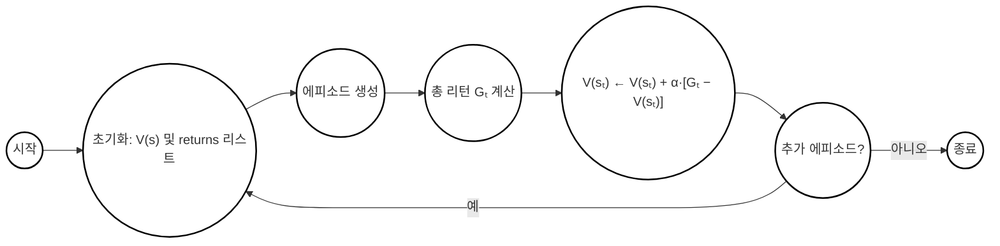
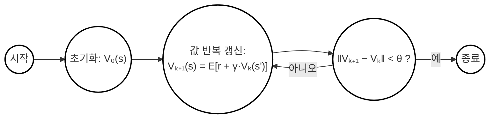
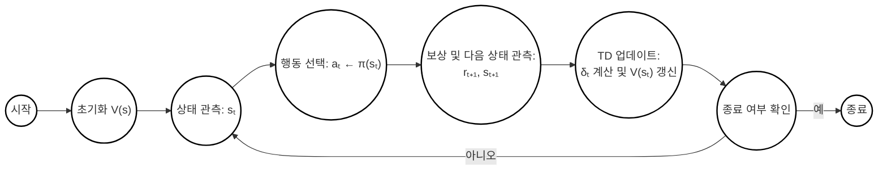

---
# Page settings
layout: default
keywords: 강화학습, 머신러닝, 인공지능, 인찬백, InchanBaek, 리워드, 에이전트, 액션, MDP, 마르코프 결정 과정, Q-러닝, reinforcement learning, machine learning, AI, reward, agent, action, Markov decision process, Q-learning, deep reinforcement learning
comments: true
seo:
  title: Reinforcement Learning from Scratch - Complete Guide | InchanBaek Note
  description: A complete guide to learning reinforcement learning from basics to advanced algorithms. It explains key concepts such as Markov decision processes, Q-learning, and policy gradient methods, along with step-by-step implementation techniques.
  canonical: https://bic98.github.io/reinforce/
  image: https://bic98.github.io/images/layout/logo.png

# Hero section
title: Reinforcement Learning from Scratch
description: A complete guide to learning reinforcement learning from basics to advanced algorithms. It explains key concepts such as Markov decision processes, Q-learning, and policy gradient methods, along with step-by-step implementation techniques.

# # Author box
# author:
#     title: About Author
#     title_url: '#'
#     external_url: true
#     description: Author description

# Micro navigation
micro_nav: true

# Page navigation
# page_nav:
#     prev:
#         content: Previous page
#         url: '/deep_learning/'
#     next:
#         content: Next page
#         url: '/qgis/'


# Language setting
---


<script type="text/javascript" async
  src="https://cdnjs.cloudflare.com/ajax/libs/mathjax/2.7.7/MathJax.js?config=TeX-MML-AM_CHTML">
</script>

## Bandit Problem

### Reinforcement Learning

- Supervised Learning : When the input and output data are given, it is a method of modeling the relationship between input data and output data. 

- Unsupervised Learning : When the input data is given, it is a method of finding the characteristics of the input data. 


- **Reinforcement Learning** : **Agent** is an entity that interacts with the **environment** and receives information about the environment to choose **actions** that **maximize rewards**.

### What is Bandit problem?

Bandit == Slot machine

Each slot machine has a different probability.

At first, we don't know which slot machine is the best.

We need to find the good machine by actually playing.

The goal is to get as much reward as possible within a limited number of plays.

<div align="center">
  <div class = 'mermaid'>
    graph LR
    A[Agent] -->|action| B[Environment]
    B -->|reward| A
  </div>
</div>


**The agent as a player selects actions in a given environment, and the environment provides rewards to the agent.**

**Goal**: **Select actions that maximize rewards** -> **Get as many coins as possible** -> **Find the best slot machine**

### Value and Action Value

- **Value**: Expected reward that can be obtained in a specific state

$$
E[R_t] 
$$

- **Action Value**: Expected reward obtained as a result of an action

$$
Q(A) = E[R_t | A] 
$$

(E = Expectation, Q = Quality, A = Action, R = Reward)

Let's calculate the expected rewards for slot machines a and b.

Below is a table for slot machine a.

| Slot machine a | 
|:---:|:---:|:---:|:---:|:---:|:---:|
| Coins obtainable | 0 | 1 | 5 | 10 |
| Reward probability | 0.70 | 0.15 | 0.12 | 0.03 |


Here's a table for slot machine b.

| Slot machine b | 
|:---:|:---:|:---:|:---:|:---:|:---:|
| Coins obtainable | 0 | 1 | 5 | 10 |
| Reward probability | 0.50 | 0.40 | 0.09 | 0.01 |

The expected values for the two machines are:

- Slot machine a: (0.7 * 0 + 0.15 * 1 + 0.12 * 5 + 0.03 * 10) = 1.05
- Slot machine b: (0.5 * 0 + 0.4 * 1 + 0.09 * 5 + 0.01 * 10) = 0.95

**Slot machine a is better than slot machine b.**

### Value Estimation

Let's say the rewards obtained during n plays are R1, R2, ..., Rn.
Then the action value estimate Qn can be calculated as follows:

$$
Q_n = \frac{R_1 + R_2 + ... + R_n}{n}
$$

However, if we estimate the value this way after n plays, the computational and memory load becomes large.
We can calculate the nth value estimate using the (n-1)th value estimate.

$$
Q_{n-1} = \frac{R_1 + R_2 + ... + R_{n-1}}{n-1}
$$

If we multiply both sides of this equation by (n-1):

$$
(n - 1)Q_{n-1} = R_1 + R_2 + ... + R_{n-1}
$$

Now we can calculate the nth value estimate:

$$
Q_n = \frac{1}{n} (R_1 + R_2 + ... + R_{n-1} + R_n) 
$$

$$
=\frac{1}{n} (n - 1)Q_{n-1} + \frac{1}{n} R_n
$$


$$
= Q_{n - 1} + \frac{1}{n} (R_n - Q_{n - 1})
$$

### Player's Policy

If we completely trust uncertain estimates, we might miss the best action. Therefore, the agent needs to reduce uncertainty and increase the reliability of estimation.

- **Policy**: The strategy that determines the actions an agent selects when interacting with the environment

There are two policies that can be used to reduce uncertainty:

1. **Exploration**: Selecting uncertain actions to gain information about the environment
2. **Exploitation**: Selecting the best action based on information available so far

**Ultimately, reinforcement learning algorithms are about finding the right 'balance between exploitation and exploration'!!!!**

### Epsilon-Greedy Policy
This is one of the algorithms used to balance exploration and exploitation.
For example, if $$\epsilon$$ = 0.1, it selects a random action with 10% probability and selects the best action with 90% probability.

### Solving the Bandit Problem

- **Action Value Estimation**: Estimate the action value and select the best action.
- **Policy**: Use the **epsilon-greedy policy** to balance **exploration** and **exploitation**.

Let's implement the above content in code.

```python

import numpy as np

class Bandit:
    def __init__(self, arms = 10):
        self.rates = [0.38991635, 0.5937864,  0.55356798, 0.46228943, 0.48251845, 0.47595196, 0.53560295, 0.43374032, 0.55913105, 0.57484477]

    def play(self, arm):
        rate = self.rates[arm]
        if rate > np.random.rand():
            return 1
        else : 
            return 0


class Agent:
    def __init__(self, epslion, action_size = 10):
        self.epslion = epslion
        self.Qs = np.zeros(action_size)
        self.Ns = np.zeros(action_size)

    def update(self, action, reward):
        self.Ns[action] += 1
        self.Qs[action] += (reward - self.Qs[action]) / self.Ns[action]

    def get_action(self):
        if np.random.rand() < self.epslion:
            return (np.random.randint(len(self.Qs)), 0)
        return (np.argmax(self.Qs), 1)

steps = 10000
agent = Agent(0.1)
bandit = Bandit()

total_reward = 0
total_rewards = []
rates = []
actions = []

for i in range(steps):
    act = agent.get_action()
    action = act[0]
    reward = bandit.play(action)
    agent.update(action, reward)
    total_reward += reward
    total_rewards.append(total_reward)
    rates.append(total_reward / (i + 1))
    if act[1] == 1:
        actions.append(action)

import matplotlib.pyplot as plt
plt.figure(figsize=(12, 6))

plt.subplot(3, 1, 1)
plt.plot(total_rewards, label='Total Reward')
plt.xlabel('Steps')
plt.ylabel('Total Reward')
plt.legend()

plt.subplot(3, 1, 2)
plt.plot(actions, label='Actions')
plt.xlabel('Steps')
plt.ylabel('Action')
plt.legend()

plt.subplot(3, 1, 3)
plt.plot(rates, label='Average Reward')
plt.xlabel('Steps')
plt.ylabel('Average Reward')
plt.legend()

plt.tight_layout()
plt.show()

```

<div align="center">
  
</div>

After about 10,000 plays, it still doesn't know that selecting the slot machine at index 1 as an action is optimal.
Let's try with more steps.

<div align="center">
  
</div>

After about 30,000 plays, it learns that selecting the slot machine at index 1 as an action is optimal.
It took an additional 20,000 plays to recognize a probability difference of about 2%.


### Non-stationary Problem

The bandit problem we've covered so far belongs to the category of **stationary problems**. A stationary problem is one where the probability distribution of rewards **does not change**. In the code above, you can see that the probabilities are fixed in the variable called rates.

However, in reality, the probability distribution of rewards often changes. This is called a **non-stationary problem**. How should we handle this?


First, in stationary problems, we updated the action value estimate with the following equation:

$$
Q_n = Q_{n - 1} + \frac{1}{n} (R_n - Q_{n - 1})
$$

But in **non-stationary problems**, we update the action value estimate with the following equation:

$$
Q_n = Q_{n - 1} + \alpha (R_n - Q_{n - 1})
$$

This method **reduces the weight of rewards obtained long ago** and **increases the weight of recently obtained rewards**. Here, $$\alpha$$ is called the **learning rate**.


<div style="overflow-x: auto;">

$$
= Q_{n - 1} + \alpha (R_n - Q_{n - 1})
$$
$$
= (1 - \alpha) Q_{n - 1} + \alpha R_n
$$
$$
= \alpha R_n + (1 - \alpha) {(\alpha R_{n - 1} + (1 - \alpha) Q_{n - 2})}
$$
$$
= \alpha R_n + (1 - \alpha) \alpha R_{n - 1} + (1 - \alpha)^2 Q_{n - 2}
$$
$$
= \alpha R_n + (1 - \alpha) \alpha R_{n - 1} + (1 - \alpha)^2 \alpha R_{n - 2} + (1 - \alpha)^3 Q_{n - 3}
$$
$$
= \alpha R_n + (1 - \alpha) \alpha R_{n - 1} + (1 - \alpha)^2 \alpha R_{n - 2} +
$$
$$
(1 - \alpha)^3 \alpha R_{n - 3} + ... + (1 - \alpha)^{n - 1} \alpha R_1 + (1 - \alpha)^n Q_0
$$

</div>

$$Q_0$$ is the initial value. Depending on the value we set, bias can occur in the learning results. However, when using sample averages, the bias disappears.


This method is called **exponential moving average** or **exponentially weighted moving average**.


- **Exponential Weighted Moving Average**: A method that gives **more weight to recently obtained rewards** and **less weight to rewards obtained long ago**


Let's implement this in Python code.

```python
import numpy as np

class Bandit:
    def __init__(self, arms = 10):
        self.rates = [0.38991635, 0.7837864,  0.55356798, 0.46228943, 0.48251845, 0.47595196, 0.53560295, 0.43374032, 0.55913105, 0.57484477]

    def play(self, arm):
        rate = self.rates[arm]
        self.rates += 0.1 * np.random.randn(len(self.rates))
        if rate > np.random.rand():
            return 1
        else : 
            return 0

class Agent:
    def __init__(self, epslion, action_size = 10):
        self.epslion = epslion
        self.Qs = np.zeros(action_size)

    def update(self, action, reward, alpha = 0.8):
        self.Qs[action] += alpha * (reward - self.Qs[action])

    def get_action(self):
        if np.random.rand() < self.epslion:
            return (np.random.randint(len(self.Qs)), 0)
        return (np.argmax(self.Qs), 1) 

steps = 50000
agent = Agent(0.1)
bandit = Bandit()

total_reward = 0
total_rewards = []
rates = []
actions = []

for i in range(steps):
    act = agent.get_action()
    action = act[0]
    reward = bandit.play(action)
    agent.update(action, reward)
    total_reward += reward
    total_rewards.append(total_reward)
    rates.append(total_reward / (i + 1))
    if act[1] == 1:
        actions.append(action)

import matplotlib.pyplot as plt
plt.figure(figsize=(12, 6))

plt.subplot(3, 1, 1)
plt.plot(total_rewards, label='Total Reward')
plt.xlabel('Steps')
plt.ylabel('Total Reward')
plt.legend()

plt.subplot(3, 1, 2)
plt.plot(actions, label='Actions')
plt.xlabel('Steps')
plt.ylabel('Action')
plt.ylim(0, 9)
plt.legend()

plt.subplot(3, 1, 3)
plt.plot(rates, label='Average Reward')
plt.xlabel('Steps')
plt.ylabel('Average Reward')
plt.ylim(0, 1)
plt.legend()

plt.tight_layout()
plt.show()
```

<div align="center">
  
</div>

When we set the fixed value $$\alpha$$ = 0.8, we can see that the results converge faster than when using sample averages.

### Summary

- **Bandit Problem**: A fundamental problem in reinforcement learning where the goal is to find a method that maximizes rewards among multiple slot machines
- **Action Value**: The expected reward obtained as a result of an action
- **Policy**: The strategy that determines the actions an agent selects when interacting with the environment
- **Epsilon-Greedy Policy**: One of the algorithms used to balance **exploration and exploitation**
- **Non-stationary Problem**: A problem where the probability distribution of rewards changes
- **Exponential Weighted Moving Average**: A method that gives **more weight to recently obtained rewards** and **less weight to rewards obtained long ago**

## Markov Decision Process

Let's examine problems where the state of the environment changes according to an agent's actions.

### What is a Markov Decision Process?

- **Markov Decision Process (MDP)**: A method of modeling an environment where the agent interacts with the environment, and the environment's state satisfies the Markov property

- **Markov Property**: The property where the **future state depends only on the current state**

MDPs require the concept of time. At a specific time, the agent takes an action, and as a result, transitions to a new state. The time unit in this case is called a time step.

<div align="center">
  <div class = 'mermaid'>
    graph LR
    A[Agent] -->|action| B[Environment]
    B -->|reward, state| A
  </div>
</div>

- **State Transition**: How does the state transition?
- **Reward**: How is the reward given?
- **Policy**: How does the agent determine its actions?

The above three elements must be expressed in formulas.

If the state transition is **deterministic**, the next state s' depends only on the current state s and action a.

**State transition function** => 
$$
s' = f(s, a)
$$

If the state transition is **probabilistic**, the next state s' depends only on the current state s and action a.

**State transition probability** =>
$$
P(s' | s, a)
$$

### Reward Function

The **reward function** returns the reward for state s and action a. It returns the reward received when the agent takes action a in state s and moves to the next state s'.

**Reward function** =>
$$
r(s, a, s')
$$


### Agent's Policy

The agent's **policy** refers to how the agent determines its actions. The agent determines its actions based solely on the **'current state'**.
This is because **'all the information needed about the environment is contained in the current state'**.

A policy that the agent decides probabilistically can be expressed as follows:

**Policy** =>
$$
\pi(a | s) = P(a | s)
$$
    
### Goal of MDP

The goal of MDP is to find a policy that maximizes rewards. The agent behaves according to the policy 
$$ 
\pi(a | s) 
$$
The next state is determined according to that action and the state transition probability $$ P(s' | s, a) $$. And the agent receives rewards according to the reward function $$ r(s, a, s') $$.

### Return

The state at time t is $$ S_t $$, according to the policy $$ \pi $$, the action is $$ A_t $$, the reward is $$ R_t $$, and this leads to a flow that transitions to the new state $$ S_{t+1} $$. The return at this time can be defined as follows:

$$
G_t = R_t + rR_{t+1} + r^2R_{t+2} + ... = \sum_{k=0}^{\infty} r^k R_{t+k}
$$

As time passes, the reward decreases exponentially due to $$ \gamma $$.

### State Value Function

The agent's goal is to maximize returns. Even if an agent starts in the same state, the returns can vary for each episode. To respond to such stochastic behavior, we use the expectation, i.e., the expected return, as an indicator.

The state value function is a function that represents the expected value of rewards that can be received in the future, starting from a specific state in reinforcement learning. It is generally represented as $$V(s)$$, where $$s$$ represents the state. The state value function is calculated according to policy $$\pi$$, and is defined by the following formula:

<div style="overflow-x: auto;">
$$
V_{\pi}(s) = \mathbb{E} \left[ \sum_{t=0}^\infty \gamma^t R_{t+1} \mid S_t = s, \pi \right]
$$
</div>

$$
= \mathbb{E}_\pi \left[G_t \mid S_t = s \right]
$$

Where:
- $$\mathbb{E}_\pi$$: Expected value according to policy $$\pi$$
- $$\gamma$$: Discount rate (0 ≤ $$\gamma$$ < 1)
- $$R_{t+1}$$: Reward at time $$t+1$$
- $$S_0 = s$$: Initial state

In other words, the state value function is used to predict the total rewards that will be received in the long term, starting from a specific state, when following a given policy. This plays an important role in evaluating the quality of a policy or finding the optimal policy.

### Optimal Policy and Optimal Value Function


In reinforcement learning, the optimal policy $$\pi^*$$ is a policy that maximizes the expected reward in all states. If the agent follows the optimal policy, it can obtain the maximum possible reward.

The optimal value function $$V^*(s)$$ is the sum of expected rewards that can be obtained when starting from state $$s$$ and following the optimal policy:

<div style="overflow-x: auto;">
$$
V^*(s) = \max_{\pi} V^{\pi}(s) = \max_{\pi} \mathbb{E}_{\pi} \left[ \sum_{t=0}^{\infty} \gamma^t R_{t+1} \mid S_0 = s \right]
$$
</div>

Similarly, the optimal action-value function $$Q^*(s,a)$$ is the sum of expected rewards that can be obtained when taking action $$a$$ in state $$s$$ and thereafter following the optimal policy:

<div style="overflow-x: auto;">
$$
Q^*(s,a) = \max_{\pi} Q^{\pi}(s,a) = \max_{\pi} \mathbb{E}_{\pi} \left[ \sum_{t=0}^{\infty} \gamma^t R_{t+1} \mid S_0 = s, A_0 = a \right]
$$
</div>

The optimal policy and optimal value function can be defined through the Bellman Optimality Equation:


<div style="overflow-x: auto;">
$$
V^*(s) = \max_{a} \left[ R(s,a) + \gamma \sum_{s'} P(s'|s,a) V^*(s') \right]
$$
</div>

<div style="overflow-x: auto;">
$$
Q^*(s,a) = R(s,a) + \gamma \sum_{s'} P(s'|s,a) \max_{a'} Q^*(s',a')
$$
</div>

The goal of reinforcement learning is to find such an optimal policy or optimal value function.

## Bellman equation

First, Summary of the Above. 

- **❓ What is an MDP?**

An MDP is a mathematical framework used to model decision-making in environments where outcomes are partly random and partly under the control of an agent. 

It consists of: 

- A set of **states (S)**
- A set of **actions (A)**
- A **transition probability function (P)**
- A **reward function (R)**
- A **discount factor (γ)**

So, MDP is the **foundation of reinforcement learning**, where an agent learns to choose actions that maximize cumulative reward over time. 


- **❓Why is important Bellman equation in MDP?**

The **Bellman equation** is important in Markov Decision Processes (MDPs) because it provides a **recursive decomposition of the value function**, which represents the expected return starting from a given state. It serves as the **foundation for many reinforcement learning algorithms**, enabling **efficient computation of optimal policies** by breaking down complex problems into smaller subproblems.

🔑 **Bellman Equation – Easy Explanation (with Keywords)**
- **The Bellman equation expresses**
"**What kind of future reward can I expect if I act well in this state?**"

- **It uses recursion to break down a complex problem into smaller subproblems.**

- **This allows us to efficiently and systematically optimize the overall policy.**

- **Many reinforcement learning algorithms like Q-learning and Value Iteration**
are based on the Bellman equation.

### Derivation of Bellman Equation. 

First, let's define 'Return at time t' as the sum of rewards from time 't'

<div style="overflow-x: auto;">
$$
G_t = R_t + \gamma R_{t+1} + \gamma^2 R_{t+2} + ... = \sum_{k=0}^{\infty} \gamma^k R_{t+k}
$$
</div>

Second, What is 'Return at time t + 1'?
<div style="overflow-x: auto;">
$$
G_{t+1} = R_{t+1} + \gamma R_{t+2} + \gamma^2 R_{t+3} + ... = \sum_{k=0}^{\infty} \gamma^k R_{t+k+1}
$$
</div>

So, we can rearrange the equation as above two equatios. 

<div style="overflow-x: auto;">
$$
G_t = R_t + \gamma G_{t+1}
$$
</div>

We know the relation between $$G_t$$ and $$G_{t+1}$$.  

Based on the state-vlaue function $$V_\pi(s)$$ we obtained earlier, we can derived the following conclusion. 

<div style="overflow-x: auto;">
$$
V_\pi(s) = \mathbb{E}_\pi[G_t | S_t = s]
    = \mathbb{E}_\pi[R_t + \gamma G_{t+1} | S_t = s]
    = \mathbb{E}_\pi[R_t | S_t = s] + \gamma \mathbb{E}_\pi[G_{t+1} | S_t = s]
$$
</div>

(Since Linearity of Expectation 👉 $$\mathbb{E}[X + Y] = \mathbb{E}[X] + \mathbb{E}[Y]$$)


<div style="text-align: center;">
    <div class="mermaid">
    graph TD
        s((s)) --> A((A))
        s((s)) --> B((B))
        s((s)) --> C((C))
        A --> A1((A1))
        A --> A2((A2))
        B --> B1((B1))
        B --> B2((B2))
        C --> C1((C1))
        C --> C2((C2))
        style s fill:#ffffff,stroke:#000000,stroke-width:2px
        style A fill:#ffffff,stroke:#000000,stroke-width:2px
        style B fill:#ffffff,stroke:#000000,stroke-width:2px
        style C fill:#ffffff,stroke:#000000,stroke-width:2px
        style A1 fill:#ffffff,stroke:#000000,stroke-width:2px
        style A2 fill:#ffffff,stroke:#000000,stroke-width:2px
        style B1 fill:#ffffff,stroke:#000000,stroke-width:2px
        style B2 fill:#ffffff,stroke:#000000,stroke-width:2px
        style C1 fill:#ffffff,stroke:#000000,stroke-width:2px
        style C2 fill:#ffffff,stroke:#000000,stroke-width:2px
    </div>
</div>


we define $$
\pi(a | s) 
$$ as the probability of taking action $$a$$ in state $$s$$.


<div style="text-align: center;">
    <div class="mermaid">
    graph TD
        s((s)) --> A((A))
        s((s)) --> B((B))
        s((s)) --> C((C))
        style s fill:#ffffff,stroke:#000000,stroke-width:2px
        style A fill:#ffffff,stroke:#000000,stroke-width:2px
        style B fill:#ffffff,stroke:#000000,stroke-width:2px
        style C fill:#ffffff,stroke:#000000,stroke-width:2px
    </div>
</div>

so 
$$
\pi(a_1 | s) = A
$$, 
$$
\pi(a_2 | s) = B
$$, 
$$
\pi(a_3 | s) = C
$$

and we choose the action along with the policy $$\pi$$. we move $$s$$ to $$s'$$ with the probability 
$$
P(s' | s, a)
$$. (P is the transition probability function)


<div style="text-align: center;">
    <div class="mermaid">
    graph TD
        A((A)) --> A1((A1))
        A --> A2((A2))
        B((B)) --> B1((B1))
        B --> B2((B2))
        C((C)) --> C1((C1))
        C --> C2((C2))
        style A fill:#ffffff,stroke:#000000,stroke-width:2px
        style B fill:#ffffff,stroke:#000000,stroke-width:2px
        style C fill:#ffffff,stroke:#000000,stroke-width:2px
        style A1 fill:#ffffff,stroke:#000000,stroke-width:2px
        style A2 fill:#ffffff,stroke:#000000,stroke-width:2px
        style B1 fill:#ffffff,stroke:#000000,stroke-width:2px
        style B2 fill:#ffffff,stroke:#000000,stroke-width:2px
        style C1 fill:#ffffff,stroke:#000000,stroke-width:2px
        style C2 fill:#ffffff,stroke:#000000,stroke-width:2px
    </div>
</div>

According to above graph, 

$$
A_1 = P(s' | s, a_1) * \pi(a_1 | s)
$$

$$
A_2 = P(s' | s, a_2) * \pi(a_2 | s)
$$

$$
B_1 = P(s' | s, a_1) * \pi(a_1 | s)
$$

$$
B_2 = P(s' | s, a_2) * \pi(a_2 | s)
$$

$$
C_1 = P(s' | s, a_1) * \pi(a_1 | s)
$$

$$
C_2 = P(s' | s, a_2) * \pi(a_2 | s)
$$

Let's generalize the above equation.

<div style="overflow-x: auto;">

$$
\mathbb{E}_\pi[R_t | S_t = s] = \sum_{a} \pi(a | s) \sum_{s'} P(s' | s, a) R(s, a, s')
$$

</div>


<div style="overflow-x: auto;">

$$
V_\pi(s) = \mathbb{E}_\pi[R_t | S_t = s] + \gamma \mathbb{E}_\pi[G_{t+1} | S_t = s]
$$


$$
= \sum_{a} \pi(a | s) \sum_{s'} P(s' | s, a) R(s, a, s') + \gamma \sum_{a} \pi(a | s) \sum_{s'} P(s' | s, a) V_\pi(s')
$$

$$
= \sum_{a} \pi(a | s) \sum_{s'} P(s' | s, a) \left[ R(s, a, s') + \gamma V_\pi(s') \right]
$$

</div>

This is the **Bellman euqation** for the state value function. 


### State Value Function and Action Value Function(Q-function)

The state value function $$V_\pi(s)$$ is the expected return starting from state $$s$$ and following policy $$\pi$$. It can be expressed as:

<div style="overflow-x: auto;">
$$
V_\pi(s) = \sum_{a} \pi(a | s) \sum_{s'} P(s' | s, a) \left[ R(s, a, s') + \gamma V_\pi(s') \right]
= \mathbb{E}_\pi \left[ G_t | S_t = s \right]
$$
</div>

The Q-function represents the expected return when taking action a in state s at time t, and thereafter following policy π.


<div style="overflow-x: auto;">
$$
q_\pi(s, a) = \mathbb{E}_\pi[G_t | S_t = s, A_t = a]
$$
</div>

In short, 

- policy 
$$\pi$$
determines how to act in a given state $$s$$

- Value function $$V_\pi(s)$$ evalutes how good it is to be in a specific state under policy $$\pi$$

- Action value function(Q-function) $$q_\pi(s, a)$$ evalutes how good it is to take a specific action in a given state under policy $$\pi$$

<div style="overflow-x: auto;">
$$
q_\pi(s, a) = \sum_{s'} P(s' | s, a) \left[ R(s, a, s') + \gamma V_\pi(s') \right] = \sum_{s'} P(s' | s, a) \left[ R(s, a, s') + \gamma \sum_{a'} \pi(a' | s') q_\pi(s', a') \right]
$$
</div>


### optimal Action Value Function

The optimal action value function $$q^*(s, a)$$ is the maximum expected return when taking action $$a$$ in state $$s$$ and thereafter following the optimal policy:

<div style="overflow-x: auto;">
$$
q^*(s, a) = \max_{\pi} q_\pi(s, a) = \mathbb{E}_{\pi} \left[ G_t | S_t = s, A_t = a \right] = \sum_{s'} P(s' | s, a) \left[ R(s, a, s') + \gamma \max_{a'} q^*(s', a') \right]
$$
</div>

### optimal Policy

We assume that the optimal action value function $$q^*(s, a)$$ is known. Then the optimal policy at state $$s$$ is defined as follows. 

<div style="overflow-x: auto;">
$$
\mu^*(s) = \arg \max_a q^*(s, a)
$$
</div>


## Dynamic Programming

Dynamic programming is a method used to solve complex problems by breaking them down into simpler subproblems. It is particularly useful in reinforcement learning for solving Markov Decision Processes (MDPs).

### 3x4 grid world

```
+---+---+---+---+
| S |   |   | G |
+---+---+---+---+
|   | # |   | B |
+---+---+---+---+
|   |   |   |   |
+---+---+---+---+
```

- `S`: Start position
- `G`: Goal position
- `#`: Obstacle or blocked cell
- `B`: Bomb location with a reward of `-1.0`
- Blank cells are navigable spaces.

```python
import numpy as np
import common.gridworld_render as render_helper


class GridWorld:
    def __init__(self):
        self.action_space = [0, 1, 2, 3]  # 행동 공간(가능한 행동들)
        self.action_meaning = {  # 행동의 의미
            0: "UP",
            1: "DOWN",
            2: "LEFT",
            3: "RIGHT",
        }

        self.reward_map = np.array(  # 보상 맵(각 좌표의 보상 값)
            [[0, 0, 0, 1.0],
             [0, None, 0, -1.0],
             [0, 0, 0, 0]]
        )
        self.goal_state = (0, 3)    # 목표 상태(좌표)
        self.wall_state = (1, 1)    # 벽 상태(좌표)
        self.start_state = (2, 0)   # 시작 상태(좌표)
        self.agent_state = self.start_state   # 에이전트 초기 상태(좌표)

    @property
    def height(self):
        return len(self.reward_map)

    @property
    def width(self):
        return len(self.reward_map[0])

    @property
    def shape(self):
        return self.reward_map.shape

    def actions(self):
        return self.action_space

    def states(self):
        for h in range(self.height):
            for w in range(self.width):
                yield (h, w)

    def next_state(self, state, action):
        # 이동 위치 계산
        action_move_map = [(-1, 0), (1, 0), (0, -1), (0, 1)]
        move = action_move_map[action]
        next_state = (state[0] + move[0], state[1] + move[1])
        ny, nx = next_state

        # 이동한 위치가 그리드 월드의 테두리 밖이나 벽인가?
        if nx < 0 or nx >= self.width or ny < 0 or ny >= self.height:
            next_state = state
        elif next_state == self.wall_state:
            next_state = state

        return next_state  # 다음 상태 반환

    def reward(self, state, action, next_state):
        return self.reward_map[next_state]

    def reset(self):
        self.agent_state = self.start_state
        return self.agent_state

    def step(self, action):
        state = self.agent_state
        next_state = self.next_state(state, action)
        reward = self.reward(state, action, next_state)
        done = (next_state == self.goal_state)

        self.agent_state = next_state
        return next_state, reward, done

    def render_v(self, v=None, policy=None, print_value=True):
        renderer = render_helper.Renderer(self.reward_map, self.goal_state,
                                          self.wall_state)
        renderer.render_v(v, policy, print_value)

    def render_q(self, q=None, print_value=True):
        renderer = render_helper.Renderer(self.reward_map, self.goal_state,
                                          self.wall_state)
        renderer.render_q(q, print_value)
```


### Class: `GridWorld`
This class represents a simple grid-based environment for reinforcement learning. It defines the grid's structure, the agent's movement, and the rewards associated with each state.

---

#### **`__init__` Method**
```python
def __init__(self):
    self.action_space = [0, 1, 2, 3]  # up, down, left, right
    self.action_meaning = {
        0: 'up',
        1: 'down',
        2: 'left',
        3: 'right'
    }
    self.reward_map = np.array([
        [0, 0, 0, 1.0],
        [0, None, 0, -1.0],
        [0, 0, 0, 0]
    ])
    self.start_state = (2, 0)
    self.wall_state = (1, 1)
    self.goal_state = (0, 3)
    self.agent_state = self.start_state
```

1. **`action_space`**: Defines the possible actions the agent can take:
   - `0`: Move up
   - `1`: Move down
   - `2`: Move left
   - `3`: Move right

2. **`action_meaning`**: Maps action indices to human-readable directions.

3. **`reward_map`**: A 2D NumPy array representing the grid. Each cell contains:
   - `0`: Neutral reward.
   - `1.0`: Positive reward (goal state).
   - `-1.0`: Negative reward (bomb state).
   - `None`: Represents an obstacle (wall).

4. **`start_state`**: The agent's starting position `(2, 0)` (row 2, column 0).

5. **`wall_state`**: The position of the wall `(1, 1)` (row 1, column 1), which the agent cannot pass through.

6. **`goal_state`**: The position of the goal `(0, 3)` (row 0, column 3).

7. **`agent_state`**: Tracks the agent's current position, initialized to the start state.

---

#### **Properties**
These properties provide useful information about the grid.

1. **`height`**
```python
@property
def height(self):
    return len(self.reward_map)
```
- Returns the number of rows in the grid.

2. **`width`**
```python
@property
def width(self):
    return len(self.reward_map[0])
```
- Returns the number of columns in the grid.

3. **`shape`**
```python
@property
def shape(self):
    return self.reward_map.shape
```
- Returns the grid's dimensions as a tuple `(rows, columns)`.

4. **`actions`**
```python
@property
def actions(self):
    return self.action_space
```
- Returns the list of possible actions.

---

#### **`state` Method**
```python
def state(self):
    for h in range(self.height):
        for w in range(self.width):
            yield (h, w)
```
- A generator that iterates over all possible states (grid cells) in the environment.
- Each state is represented as a tuple `(row, column)`.

---

#### **`next_state` Method**
```python
def next_state(self, state, action):
    action_move_map = [(-1, 0), (1, 0), (0, -1), (0, 1)]
    move = action_move_map[action]
    next_state = (state[0] + move[0], state[1] + move[1])
    ny, nx = next_state

    if ny < 0 or ny >= self.height or nx < 0 or nx >= self.width:
        next_state = state

    if next_state == self.wall_state:
        next_state = state

    return next_state
```

1. **`action_move_map`**: Maps actions to their corresponding movements:
   - `(-1, 0)`: Move up (decrease row index).
   - `(1, 0)`: Move down (increase row index).
   - `(0, -1)`: Move left (decrease column index).
   - `(0, 1)`: Move right (increase column index).

2. **`next_state`**: Calculates the agent's next position based on the current state and action.

3. **Boundary Check**:
   - If the next state is outside the grid's boundaries, the agent stays in the current state.

4. **Wall Check**:
   - If the next state is a wall, the agent stays in the current state.

5. **Returns**: The valid next state after applying the action.

---

#### **`reward` Method**
```python
def reward(self, state, action, next_state):
    return self.reward_map[next_state]
```

1. **Inputs**:
   - `state`: The current state.
   - `action`: The action taken.
   - `next_state`: The resulting state after the action.

2. **Returns**: The reward associated with the `next_state`, as defined in the `reward_map`.

---

### Summary
The `GridWorld` class provides a simple environment for reinforcement learning:
- It defines the grid layout, including walls, rewards, and penalties.
- It allows the agent to move within the grid while handling boundaries and obstacles.
- It provides rewards based on the agent's position.


```python
env = GridWorld()
env.render_v()
```

<div align="center">
  
</div>

### Implementation of Iterative Policy Evaluation

First, let's implement a function that performs a single step of the update.

 - pi(difaultdict) : `policy`
 - V (defaultdict) : `value function`
 - env(GridWorld) : `environment`
 - gamma (float) : `discount factor`

```python
from collections import defaultdict
from common.gridworld import GridWorld

pi = defaultdict(lambda: {0: 0.25, 1: 0.25, 2: 0.25, 3: 0.25})
V = defaultdict(lambda: 0.0)

env = GridWorld()

def eval_onestep(pi, V, env, gamma = 0.9):
    for state in env.states():
        if state == env.goal_state:
            V[state] = 1.0
            continue

        action_probs = pi[state]
        new_V = 0
        for action, action_prob in action_probs.items():
            next_state = env.next_state(state, action)
            r = env.reward(state, action, next_state)
            new_V += action_prob * (r + gamma * V[next_state])
        V[state] = new_V
    return V

eval_onestep(pi, V, env)
env.render_v(V, pi)
```

If we try one step of the update, we can see the result below.

<div align="center">
     
</div>

```python
        action_probs = pi[state]
        new_V = 0
        for action, action_prob in action_probs.items():
            next_state = env.next_state(state, action)
            r = env.reward(state, action, next_state)
            new_V += action_prob * (r + gamma * V[next_state])
        V[state] = new_V
```

this code is defined as follows. 

$$
s' = f(s, a)
$$

and, 

$$
V_{k + 1}(s) = \sum_{a} \pi(a | s) \left[r(s, a, s') + \gamma V_k(s') \right]
$$

Therefore, we continue repeating this process until the threshold is reached.

```python
def policy_eval(pi, V, env, gamma=0.9, threshold=1e-5):
    while True:
        old_V = V.copy()
        V = eval_onestep(pi, V, env, gamma)
        delta = 0
        for state in V.keys():
            t = abs(old_V[state] - V[state])
            if delta < t:
                delta = t
        if delta < threshold:
            break
    return V
```

<div align="center">
  
</div>


### Policy Iteration Method

- `Optimal Policy`: $$ \pi^*(s) $$
- `Optimal Value Function`: $$ V^*(s) $$
- `Optimal Action Value Function`: $$ Q^*(s, a) $$
- `Optimal Action`: 
<div style="overflow-x: auto;">

$$ \mu^*(s) = \arg \max_a Q^*(s, a) $$

$$
= \arg \max_a \sum_{s'} P(s' | s, a) \left[ R(s, a, s') + \gamma V^*(s') \right]
$$
</div>

What do we call the process of finding the optimal policy through repeated evaluation and greedification?

Policy Iteration is an algorithm for findings the optmal policy in a MDPs by alternating between two phase. 

- 1 **Policy Evaluation**: calculate the value function for the current policy by iteratively applying the Bellman expectation equation until convergence. 

- 2 **Policy Improvement**: update the policy to be greedy with respect to the current value function. This means for each state, selecting the action that maximizes expected value. 


By repeating these two steps until the policy no longer changes, we can find the optimal policy. This approach is guaranteed to converge to the optimal policy in finite MDPs. 

In gridworld, since states transition uniquely, we can define greedification as follows. 

<div style="overflow-x: auto;">
$$
\mu^*(s) = \arg \max_a \sum_{s'} P(s' | s, a) \left[ R(s, a, s') + \gamma V^*(s') \right]
= \arg \max_a \left[ R(s, a, s') + \gamma V^*(s') \right]
$$
</div>

```python
def greedy_policy(V, env, gamma=0.9):
    pi = {}
    for state in env.states():
        action_values = {}
        for action in env.actions():
            next_state = env.next_state(state, action)
            r = env.reward(state, action, next_state)
            action_values[action] = r + gamma * V[next_state]
        max_action = max(action_values, key=lambda a: action_values[a])
        action_probs = {a: 0.0 for a in env.actions()}
        action_probs[max_action] = 1.0
        pi[state] = action_probs
    return pi

def policy_iter(env, gamma, threshold = 1e-4, is_render = False):
    pi = defaultdict(lambda: {0: 0.25, 1: 0.25, 2: 0.25, 3: 0.25})
    V = defaultdict(lambda: 0.0)
    while True:
        V = policy_eval(pi, V, env, gamma, threshold)
        new_pi = greedy_policy(V, env, gamma)
        if is_render:
            env.render_v(V, pi)
        if new_pi == pi:
            break
        pi = new_pi
    return pi, V

if __name__ == "__main__":
    env = GridWorld()
    gamma = 0.9
    pi = policy_iter(env, gamma, is_render=True)
```

this result is two step of the policy iteration.

<div align="center">
  
</div>

Four steps of the policy iteration are as follows.

<div align="center">
  
</div>

By implementing it this way, the value function of all states is updated multiple times. It's too slow. Is there a way to update only one state's value function and proceed?


### Value Iteration Method

#### Why Value Iteration Works

Policy Iteration has two separate steps - policy evaluation (which runs until convergence) and policy improvement. This is computationally expensive because we're repeatedly evaluating the entire state space multiple times before making a single policy improvement.

Value Iteration addresses this inefficiency by recognizing that:

- **Similar Calculations** - Both policy evaluation and improvement use the Bellman equation structure
- **Partial Convergence** - We can improve the policy before the value function fully converges
- **Combined Steps** - We can directly incorporate the max operation into the value update

#### How Value Iteration Works

Value Iteration combines policy evaluation and improvement into a single update:

$$V(s) \leftarrow \max_a \left[R(s,a) + \gamma \sum_{s'} P(s'|s,a) \cdot V(s') \right]$$

This update directly finds the value of the best action for each state, effectively:

- Assuming a greedy policy at each step
- Skipping the explicit policy representation
- Performing only one sweep through the state space per iteration

#### Value Iteration Algorithm

1. Initialize $$V(s) = 0$$ for all states
2. Repeat until convergence:
   - For each state $$s$$:
    <div style="overflow-x: auto;">
         $$V(s) \leftarrow \max_a \left[R(s,a) + \gamma \sum_{s'} P(s'|s,a) \cdot V(s') \right]$$
    </div>

3. Extract the final policy:
<div style="overflow-x: auto;"> 
   $$\pi(s) = \arg\max_a \left[R(s,a) + \gamma \sum_{s'} P(s'|s,a) \cdot V(s') \right]$$
</div>

#### Advantages Over Policy Iteration

- **Computational Efficiency** - No need to perform full policy evaluation at each step
- **Fewer Iterations** - Usually converges in fewer sweeps through the state space
- **Simplicity** - Only need to maintain a value function, not an explicit policy
- **Direct Optimization** - Works towards optimal values from the start

For deterministic environments like our grid world example, the update becomes even simpler:

<div style="overflow-x: auto;">
$$V(s) \leftarrow \max_a \left[R(s,a) + \gamma \cdot V(\text{next_state}(s,a)) \right]$$
</div>

This makes Value Iteration particularly efficient for deterministic problems.

```python
def value_iter_onestep(V, env, gamma=0.9):
    for state in env.states():
        if state == env.goal_state:
            V[state] = 0.0
            continue
        action_values = []
        for action in env.actions():
            next_state = env.next_state(state, action)
            r = env.reward(state, action, next_state)
            value = r + gamma * V[next_state]
            action_values.append(value)
        V[state] = max(action_values)
    return V

def value_iter(V, env, gamma, threshold=1e-3, is_render=True):
    while True:
        if is_render:
            env.render_v(V)
        old_V = V.copy()
        V = value_iter_onestep(V, env, gamma)
        delta = 0
        for state in V.keys():
            t = abs(old_V[state] - V[state])
            if delta < t:
                delta = t
        if delta < threshold:
            break
    return V

if __name__ == "__main__":
    env = GridWorld()
    V = defaultdict(lambda: 0.0)
    gamma = 0.9
    V = value_iter(V, env, gamma, threshold=1e-3, is_render=True)
    pi = greedy_policy(V, env, gamma)
    env.render_v(V, pi)
```

1. one step of the value iteration

<div align="center">
  
</div>

2. two step of the value iteration

<div align="center">
  
</div>


3. three step of the value iteration

<div align="center">
  
</div>
4. four step of the value iteration

<div align="center">
  
</div>

So, the result of optimal policy is as follows.

<div align="center">
  
</div>

## Monte Carlo Method

We know the transition probabilities $$ P( s, a) $$ and the reward function $$ R $$, which allows us to apply Dynamic Programming.

Also, using dynamic programming (DP) is too complex to calculate the entire problem.

**What is Monte Carlo method?**

It assumes a value function for the agent to gain experience in an environment.
The experience mentioned here refers to the data (state, action, reward) obtained through the interaction between the environment and the agent.


The following situation can be considered: Think about all possible outcomes when rolling a dice twice.

<div align="center">
  <div class = 'mermaid'>
graph TD
    Start((Start))
    Start --> D1((Die 1: 1))
    Start --> D2((Die 1: 2))
    Start --> D3((Die 1: 3))
    Start --> D4((Die 1: 4))
    Start --> D5((Die 1: 5))
    Start --> D6((Die 1: 6))

    D1 --> D1_1((Die 2: 1))
    D1 --> D1_2((Die 2: 2))
    D1 --> D1_3((Die 2: 3))
    D1 --> D1_4((Die 2: 4))
    D1 --> D1_5((Die 2: 5))
    D1 --> D1_6((Die 2: 6))

    D2 --> D2_1((Die 2: 1))
    D2 --> D2_2((Die 2: 2))
    D2 --> D2_3((Die 2: 3))
    D2 --> D2_4((Die 2: 4))
    D2 --> D2_5((Die 2: 5))
    D2 --> D2_6((Die 2: 6))

    D3 --> D3_1((Die 2: 1))
    D3 --> D3_2((Die 2: 2))
    D3 --> D3_3((Die 2: 3))
    D3 --> D3_4((Die 2: 4))
    D3 --> D3_5((Die 2: 5))
    D3 --> D3_6((Die 2: 6))

    D4 --> D4_1((Die 2: 1))
    D4 --> D4_2((Die 2: 2))
    D4 --> D4_3((Die 2: 3))
    D4 --> D4_4((Die 2: 4))
    D4 --> D4_5((Die 2: 5))
    D4 --> D4_6((Die 2: 6))

    D5 --> D5_1((Die 2: 1))
    D5 --> D5_2((Die 2: 2))
    D5 --> D5_3((Die 2: 3))
    D5 --> D5_4((Die 2: 4))
    D5 --> D5_5((Die 2: 5))
    D5 --> D5_6((Die 2: 6))

    D6 --> D6_1((Die 2: 1))
    D6 --> D6_2((Die 2: 2))
    D6 --> D6_3((Die 2: 3))
    D6 --> D6_4((Die 2: 4))
    D6 --> D6_5((Die 2: 5))
    D6 --> D6_6((Die 2: 6))

    classDef circle fill:#ffffff,stroke:#000000,stroke-width:2px,shape:circle;
    class Start,D1,D2,D3,D4,D5,D6,D1_1,D1_2,D1_3,D1_4,D1_5,D1_6,D2_1,D2_2,D2_3,D2_4,D2_5,D2_6,D3_1,D3_2,D3_3,D3_4,D3_5,D3_6,D4_1,D4_2,D4_3,D4_4,D4_5,D4_6,D5_1,D5_2,D5_3,D5_4,D5_5,D5_6,D6_1,D6_2,D6_3,D6_4,D6_5,D6_6 circle;
  </div>
</div>


If some outcomes represent a probability distribution, we use the sample distribution.
A sample distribution is a method of observing the results of actual sampling.


Let's use the incremental method learned earlier to sample and calculate the expected value of the sum when two dice are rolled.

`incremental method` : $$ V_n = V_{n - 1} + \frac{1}{n} (s_n - V_{n - 1}) $$

```python
trial = 10000
import numpy as np


def Sample():
    x = 0
    for _ in range(2):
        x += np.random.choice([1, 2, 3, 4, 5, 6])
    return x


trial = 1000
V, n = 0, 0


for i in range(trial):
    s = Sample()
    n += 1
    V += (s - V) / n
    if (i + 1) % 100 == 0:
        print(f"Trial {i + 1}: Sample mean = {V}")

# result
# Trial 100: Sample mean = 7.119999999999997
# Trial 200: Sample mean = 6.8199999999999985
# Trial 300: Sample mean = 6.783333333333331
# Trial 400: Sample mean = 6.8575
# Trial 500: Sample mean = 6.844000000000001
# Trial 600: Sample mean = 6.861666666666671
# Trial 700: Sample mean = 6.8885714285714315
# Trial 800: Sample mean = 6.8999999999999995
# Trial 900: Sample mean = 6.948888888888891
# Trial 1000: Sample mean = 6.938000000000002
```

`Value - Function` : $$ V_n = \mathbb{E_{\pi}}[G \mid s] $$

This method applies the Monte Carlo approach to estimate values.

<div style="overflow-x: auto;">
$$
V_{\pi}(s) = \frac{G^{(1)} + G^{(2)}+ G^{(3)} + \cdots + G^{(n)}}{n}
$$
</div>

where $$ G^{(i)} $$ is the return of the $$ i $$-th episode.

Let me explain the first trial episode.

<div align="center">
  <div class="mermaid">
graph TD
    S((S))
    S -->|reward_1| A((A))
    A -->|reward_0| B((B))
    B -->|reward_2| END((END))

    classDef circle fill:#ffffff,stroke:#000000,stroke-width:2px,shape:circle;
    class S,A,B,C,END circle;
  </div>
</div>

<div style="overflow-x: auto;">
$$
G^{(1)} = 1 + 0 + 2 = 3
$$
</div>

The second trial episode is as follows.

<div align="center">
  <div class="mermaid">
graph TD
    S((S))
    S -->|reward_1| A((A))
    A -->|reward_0| B((B))
    B -->|reward_1| C((C))
    C -->|reward_1| END((END))

    classDef circle fill:#ffffff,stroke:#000000,stroke-width:2px,shape:circle;
    class S,A,B,C,END circle;

  </div>
</div>

<div style="overflow-x: auto;">
$$
G^{(2)} = 1 + 0 + 1 + 1 = 3
$$
</div>

As a result, the expected value is as follows. 

<div style="overflow-x: auto;">
$$
V_{\pi}(s) = \frac{G^{(1)} + G^{(2)}}{2} = \frac{3 + 3}{2} = 3
$$
</div>

Let's calculate the value function for all states using the Monte Carlo method. If there are three states (A, B, C), sample data is obtained by performing actual actions.

<div align="center">
  <div class="mermaid">
flowchart TD

    %% A 파이프라인 1
    A1((A)) --> A2([...]) --> A3([...]) --> Aout((○))

    %% A 파이프라인 2
    A1b((A)) --> A2b([...]) --> A3b([...]) --> Aoutb((○))


    %% B 파이프라인 1
    B1((B)) --> B2([...]) --> B3([...]) --> Bout((○))

    %% B 파이프라인 2
    B1b((B)) --> B2b([...]) --> B3b([...]) --> Boutb((○))

    %% C 파이프라인 1
    C1((C)) --> C2([...]) --> C3([...]) --> Cout((○))

    %% C 파이프라인 2
    C1b((C)) --> C2b([...]) --> C3b([...]) --> Coutb((○))

    %% 스타일 지정
    classDef aStyle fill:#b3d9ff,stroke:#3399ff,stroke-width:2px
    classDef bStyle fill:#ffcc99,stroke:#ff9933,stroke-width:2px
    classDef cStyle fill:#99ffcc,stroke:#33cc99,stroke-width:2px

    class A1,A2,A3,Aout,A1b,A2b,A3b,Aoutb aStyle
    class B1,B2,B3,Bout,B1b,B2b,B3b,Boutb bStyle
    class C1,C2,C3,Cout,C1b,C2b,C3b,Coutb cStyle
</div>
</div>

Let's consider starting from state A, taking actions according to policy $$ \pi $$, and reaching the final destination.

<div align="center">
  <div class="mermaid">
graph TD
    A((A))
    A -->|R0| B((B))
    B -->|R1| C((C))
    C -->|R2| END((END))

    classDef aStyle fill:#b3d9ff,stroke:#3399ff,stroke-width:2px
    classDef bStyle fill:#ffcc99,stroke:#ff9933,stroke-width:2px
    classDef cStyle fill:#99ffcc,stroke:#33cc99,stroke-width:2px
    classDef circle fill:#ffffff,stroke:#000000,stroke-width:2px,shape:circle;

    class A aStyle
    class B bStyle
    class C cStyle
    class END circle;
</div>
</div>

The total rewards accumulated from state A to the end are as follows.

<div style="overflow-x: auto;">
$$
G_A = R_0 + \gamma R_1 + \gamma^2 R_2
$$
</div>

Let's consider starting from state B. 

<div align="center">
  <div class="mermaid">
graph TD
    B((B)) -->|R1| C((C))
    C -->|R2| END((END))

    classDef aStyle fill:#b3d9ff,stroke:#3399ff,stroke-width:2px
    classDef bStyle fill:#ffcc99,stroke:#ff9933,stroke-width:2px
    classDef cStyle fill:#99ffcc,stroke:#33cc99,stroke-width:2px
    classDef circle fill:#ffffff,stroke:#000000,stroke-width:2px,shape:circle;

    class B bStyle
    class C cStyle
    class END circle;
</div>
</div>


<div style="overflow-x: auto;">
$$
G_B = R_1 + \gamma R_2
$$
</div>

Let's consider starting from state C. 

<div align="center">
  <div class="mermaid">
graph TD
    C((C)) -->|R2| END((END))

    classDef aStyle fill:#b3d9ff,stroke:#3399ff,stroke-width:2px
    classDef bStyle fill:#ffcc99,stroke:#ff9933,stroke-width:2px
    classDef cStyle fill:#99ffcc,stroke:#33cc99,stroke-width:2px
    classDef circle fill:#ffffff,stroke:#000000,stroke-width:2px,shape:circle;

    class C cStyle
    class END circle;
</div>
</div>

<div style="overflow-x: auto;">
$$
G_C = R_2
$$
</div>

So, the following sequence of calculations can eliminate redundant computations.

<div style="overflow-x: auto;">
$$
G_C = R_2
$$
</div>

<div style="overflow-x: auto;">
$$
G_B = R_1 + \gamma G_C
$$
</div>

<div style="overflow-x: auto;">
$$
G_A = R_0 + \gamma G_B
$$
</div>

### implement

Alright, according to the reading, we can implement this for the agent to interact with the environment.

<div align="center">
  
</div>

The start point is (0, 0), the end point is (5, 5), and the black cell represents a wall that the agent cannot pass.

<div align="center">
  
</div>

```python
import numpy as np
from tqdm import tqdm
from collections import defaultdict
from common.gridworld import GridWorld

reward_map = np.array(
    [[0, 0, 0, -1.0, 0, None],
     [0, 0, 0, 0, -1.0, 0],
     [None, 0, -1.0, 0, 0, 0],
     [0, -1.0, 0, 0, None, 0],
     [0, None, -1.0, 0, 0, 0],
     [None, 0, 0, None, 0, 1.0]]
)

start = (0, 0)
goal = (5, 5)

env = GridWorld(reward_map, start, goal)
env.render_v()


class RandomAgent:
    def __init__(self):
        self.gamma = 0.9
        self.action_size = 4

        random_actions = {0: 0.25, 1: 0.25, 2: 0.25, 3: 0.25}
        self.pi = defaultdict(lambda: random_actions)
        self.V = defaultdict(lambda: 0.0)
        self.cnts = defaultdict(lambda: 0.0)
        self.memory = []

    def get_action(self, state):
        action_probs = self.pi[state]
        actions = list(action_probs.keys())
        probs = list(action_probs.values())
        return np.random.choice(actions, p=probs)

    def add(self, state, action, reward):
        data = (state, action, reward)
        self.memory.append(data)

    def reset(self):
        self.memory.clear()

    def eval(self):
        G = 0
        for data in reversed(self.memory):
            state, _, reward = data
            G = reward + self.gamma * G
            self.cnts[state] += 1
            self.V[state] += (G - self.V[state]) / self.cnts[state]


agent = RandomAgent()

episodes = int(1e3)
for episode in tqdm(range(episodes), desc="Training Progress"):
    state = env.reset()
    agent.reset()

    while True:
        action = agent.get_action(state)
        next_state, reward, done = env.step(action)
        agent.add(state, action, reward)
        if done:
            agent.eval()
            break
        state = next_state

env.render_v(agent.V)
```

The value function (expected value) of each cell obtained through the Monte Carlo method is as follows.

<div align="center">
  
</div>

### Policy Control Using the Monte Carlo Method

The optimal policy alternates between evaluation and improvement.
- **Policy Evaluation**: Calculate the value function for the current policy using the Monte Carlo method.
- **Policy Improvement**: Update the policy to be greedy with respect to the current value function.

State Value Function Evaluation

- `General Method` : $$ V_{\pi}(s) = \frac{G^{(1)} + G^{(2)}+ G^{(3)} + \cdots + G^{(n)}}{n} $$

- `Incremental Method` : $$ V_{\pi}(s) = V_{\pi}(s) + \frac{1}{n} (G - V_{\pi}(s)) $$

Q-Function Evaluation

- `General Method` : $$ Q_{\pi}(s, a) = \frac{G^{(1)} + G^{(2)}+ G^{(3)} + \cdots + G^{(n)}}{n} $$

- `Incremental Method` : $$ Q_{\pi}(s, a) = Q_{\pi}(s, a) + \frac{1}{n} (G - Q_{\pi}(s, a)) $$


### important concept

1. Use an epsilon-greedy policy to give the agent opportunities to explore. 

2. Train the model by applying an exponential moving average with a fixed value `a`, giving greater weight to more recent data.

```python
import numpy as np
import common.gridworld_render as render_helper


class GridWorld:
    def __init__(self, reward_map, start, goal):
        self.action_space = [0, 1, 2, 3]  # 행동 공간(가능한 행동들)
        self.action_meaning = {  # 행동의 의미
            0: "UP",
            1: "DOWN",
            2: "LEFT",
            3: "RIGHT",
        }

        self.reward_map = reward_map if reward_map is not None else np.array([
            [0, 0, 0, 0, 0, 0],
            [0, None, None, None, None, 0],
            [0, None, 0, 0, None, 0],
            [0, None, 0, None, None, 0],
            [0, 0, 0, 0, 0, 10],
        ])

        self.goal_state = goal
        self.wall_state = set(
            zip(*np.where(self.reward_map == None)))  # 벽 상태(좌표)
        self.start_state = start
        self.agent_state = self.start_state   # 에이전트 초기 상태(좌표)

    @property
    def height(self):
        return len(self.reward_map)

    @property
    def width(self):
        return len(self.reward_map[0])

    @property
    def shape(self):
        return self.reward_map.shape

    def actions(self):
        return self.action_space

    def states(self):
        for h in range(self.height):
            for w in range(self.width):
                yield (h, w)

    def next_state(self, state, action):
        # 이동 위치 계산
        action_move_map = [(-1, 0), (1, 0), (0, -1), (0, 1)]
        move = action_move_map[action]
        next_state = (state[0] + move[0], state[1] + move[1])
        ny, nx = next_state

        # 이동한 위치가 그리드 월드의 테두리 밖이나 벽인가?
        if nx < 0 or nx >= self.width or ny < 0 or ny >= self.height:
            next_state = state
        elif next_state in self.wall_state:
            next_state = state

        return next_state  # 다음 상태 반환

    def reward(self, state, action, next_state):
        return self.reward_map[next_state]

    def reset(self):
        self.agent_state = self.start_state
        return self.agent_state

    def step(self, action):
        state = self.agent_state
        next_state = self.next_state(state, action)
        reward = self.reward(state, action, next_state)
        done = (next_state == self.goal_state)

        self.agent_state = next_state
        return next_state, reward, done

    def render_v(self, v=None, policy=None, print_value=True):
        renderer = render_helper.Renderer(self.reward_map, self.goal_state,
                                          self.wall_state)
        renderer.render_v(v, policy, print_value)

    def render_q(self, q=None, print_value=True):
        renderer = render_helper.Renderer(self.reward_map, self.goal_state,
                                          self.wall_state)
        renderer.render_q(q, print_value)
```

Define the grid environment and the way the agent moves (policy).


```python
import os, sys
from tqdm import tqdm
import numpy as np
from collections import defaultdict
from common.gridworld import GridWorld

def greedy_probs(Q, state, epsilon=0.0, action_size=4):
    qs = [Q[(state, action)] for action in range(action_size)]
    max_action = int(np.argmax(qs))

    base_prob = epsilon / action_size
    action_probs = {action: base_prob for action in range(action_size)}  #{0: ε/4, 1: ε/4, 2: ε/4, 3: ε/4}
    action_probs[max_action] += (1 - epsilon)
    return action_probs


class McAgent:
    def __init__(self):
        self.gamma = 0.9
        self.epsilon = 0.1  # (첫 번째 개선) ε-탐욕 정책의 ε
        self.alpha = 0.1    # (두 번째 개선) Q 함수 갱신 시의 고정값 α
        self.action_size = 4

        random_actions = {0: 0.25, 1: 0.25, 2: 0.25, 3: 0.25}
        self.pi = defaultdict(lambda: random_actions)
        self.Q = defaultdict(lambda: 0)
        # self.cnts = defaultdict(lambda: 0)
        self.memory = []

    def get_action(self, state):
        action_probs = self.pi[state]
        actions = list(action_probs.keys())
        probs = list(action_probs.values())
        return np.random.choice(actions, p=probs)

    def add(self, state, action, reward):
        data = (state, action, reward)
        self.memory.append(data)

    def reset(self):
        self.memory.clear()

    def update(self):
        G = 0
        for data in reversed(self.memory):
            state, action, reward = data
            G = self.gamma * G + reward
            key = (state, action)
            # self.cnts[key] += 1
            # self.Q[key] += (G - self.Q[key]) / self.cnts[key]
            self.Q[key] += (G - self.Q[key]) * self.alpha
            self.pi[state] = greedy_probs(self.Q, state, self.epsilon)


reward_map = np.array(
    [[0, 0, 0, -1.0, 0, None],
     [0, 0, 0, 0, -1.0, 0],
     [None, 0, -1.0, 0, 0, 0],
     [0, -1.0, 0, 0, None, 0],
     [0, None, -1.0, 0, 0, 0],
     [None, 0, 0, None, 0, 1.0]]
)

start = (0, 0)
goal = (5, 5)

env = GridWorld(reward_map, start, goal)
agent = McAgent()

episodes = int(1e4)

for episode in tqdm(range(episodes), desc="Training Progress"):
    state = env.reset()
    agent.reset()

    while True:
        action = agent.get_action(state)
        next_state, reward, done = env.step(action)
        agent.add(state, action, reward)
        if done:
            agent.update()
            break
        state = next_state

env.render_q(agent.Q)
```

The agent alternates between exploration and exploitation over 10,000 episodes. Additionally, it reduces the weight of past experiences and assigns higher weight to the rewards obtained through current experiences.

The Q(S, a) for each state is as follows.

<div align="center">
  
</div>

And, The Optimal Policy for each state is as follows. 

<div style="display: flex; justify-content: center; gap: 10px;">
  
  
</div>

### Montecarlo method QUIZ!

<details>
<summary>1. 상태 가치 함수 \(V(s)\) 추정</summary>

몬테카를로 방법에서 상태 가치 함수 \(V(s)\)를 추정할 때, 전체 에피소드의 평균을 이용하는 일반적인 방법과 점진적(incremental) 방법의 차이점을 설명하라. 이 두 방법의 장단점을 비교하고, 실제 구현 시 어떤 경우에 점진적 방법이 더 유리한지 서술하라.
 

<details>
<summary> 1.정답 </summary>
일반적인 방식은 각 상태에서 얻어진 모든 return 값을 저장한 뒤, 이들의 평균을 통해 상태 가치 함수 \(V(s)\)를 계산하므로 메모리 사용량이 커지고, 에피소드 수가 많아질수록 계산량 또한 누적적으로 증가하게 된다. 반면 증분 방식(incremental update)은 직전까지의 평균값 \(V_{n-1}(s)\)을 기반으로 새로 들어온 return \(G_n\)을 단일 수식으로 갱신하기 때문에, 과거 데이터를 모두 저장할 필요 없이 온라인 환경에서도 효율적으로 작동하며, 메모리 사용이 적고 연산도 가볍다는 장점이 있다. 따라서 데이터가 실시간으로 들어오거나 에피소드 수가 사전에 정해지지 않은 경우에는 증분 방식이 특히 유리하다.
</details>
</details>

<details>
<summary>2. 에피소드와 리턴 \(G_0\)</summary>

\(S_0 \rightarrow a_0, r_0 \rightarrow S_1 \rightarrow a_1, r_1 \rightarrow S_2 \rightarrow a_2, r_2 \rightarrow end\)

할인율 \(\gamma\)가 주어졌을 때, 이 에피소드를 바탕으로 \(S_0\) 상태의 리턴 \(G_0\)을 정의하라. 그리고 이를 기반으로 몬테카를로 방법으로 \(V(S_0)\)을 어떻게 추정하는지 수식과 함께 서술하라.

<br>

<details>
<summary> 2.정답 </summary>
에이전트가 \(s_0\) 상태에서 시작해 \(r_0, r_1, r_2\)의 보상을 순차적으로 받는 경우, 
\(G_0\)는 할인율 \(\gamma\)를 적용한 누적 보상으로 다음과 같이 정의된다:

\[
G_0 = r_0 + \gamma r_1 + \gamma^2 r_2
\]

이는 첫 번째 상태에서의 총 return을 의미하며, 이를 여러 에피소드에서 반복 측정하여 
얻은 평균값을 통해 상태 가치 함수 \(V(s_0)\)를 다음과 같이 추정할 수 있다:

\[
V(s_0) = \mathbb{E}_\pi [G_0 \mid s_0]
\]

Monte Carlo 방식은 이와 같이 각 에피소드의 return을 이용하여 직접적인 추정을 수행하며, 
정책 \(\pi\)에 따라 얻어진 실제 경로의 경험을 바탕으로 기대값을 근사한다.
</details>
</details>


<details>
<summary>3. 중요도 샘플링</summary>

오프-정책 몬테카를로 예측에서 사용되는 중요도 샘플링(importance sampling)의 개념을 설명하라. 그리고 Ordinary Importance Sampling과 Weighted Importance Sampling의 차이점을 설명하고, 각 방식의 수렴 특성과 분산 차이를 서술하라.


<details>
<summary>3.정답</summary>
중요도 샘플링은 off-policy Monte Carlo 학습에서 사용된다. 이는 데이터를 만든 행동 정책과 우리가 학습하려는 목표 정책이 다를 때, 그 차이를 보정하기 위해 사용된다. 예를 들어, 행동 정책이 랜덤으로 영화를 추천하고, 목표 정책이 사용자가 좋아할 가능성이 높은 영화를 추천한다고 하자. 이 경우, 각 에피소드에서 계산된 결과에 행동 확률과 목표 확률의 비율을 곱해 기대값을 다시 계산한다. 일반적 중요도 샘플링은 모든 비율을 곱해 평균을 내며, 수렴은 보장되지만 변동성이 크다. 반면, 가중 중요도 샘플링은 전체 확률의 합으로 정규화해 변동성은 낮지만 약간의 편향이 생길 수 있다.

</details>
</details>


<details>
<summary>4. Epsilon-greedy 정책</summary>

Epsilon-greedy 정책을 사용한 몬테카를로 제어법에서 정책 개선(policy improvement)이 어떤 방식으로 이루어지는지 설명하라. 특히 \(\epsilon\)이 작거나 클 때 정책의 수렴 속도나 안정성에 어떤 영향을 미치는지도 논하라.

<details>
<summary>정답</summary>
Epsilon-greedy 정책에서는 대부분의 경우(1 - ε 확률) 현재까지 가장 가치가 높다고 판단되는 행동을 선택하고, 나머지 ε 확률로는 임의의 행동을 고른다. 이렇게 하면 탐험과 이용의 균형을 맞출 수 있다. ε 값이 작으면 에이전트가 거의 항상 최선의 행동만 선택하므로 빠르게 수렴할 수 있지만, 최적이 아닐 수도 있는 행동에 대한 탐험이 부족해질 수 있다. 반대로 ε 값이 크면 다양한 행동을 많이 시도해 안정적으로 최적 정책을 찾을 수 있지만, 수렴 속도가 느려질 수 있다.
</details>
</details>


<details>
<summary>5. Exploring Starts 가정</summary>

Monte Carlo 예측(Monte Carlo Prediction)에서 Exploring Starts 가정이 필요한 이유는 무엇인가? 이 가정을 현실적으로 적용하기 어려운 이유와, 이를 대신할 수 있는 방법(예: \(\epsilon\)-greedy)을 설명하라.

<details>
<summary>정답</summary>
Monte Carlo 예측에서 Exploring Starts 가정이 필요한 이유는 모든 상태-행동 쌍이 적어도 한 번은 방문되어야 올바른 가치 추정이 가능하기 때문이다. 하지만 실제 환경에서는 임의의 상태와 행동에서 에피소드를 시작하는 것이 어렵다. 이를 대신할 수 있는 방법으로는 ε-greedy 정책처럼 일부러 무작위 행동을 섞어 모든 상태-행동 쌍을 자연스럽게 방문하도록 만드는 방법이 있다.
</details>
</details>


<details>
<summary>6. Q-값 업데이트</summary>

$$
Q[(s, a)] += \alpha (G - Q[(s, a)])
$$

이 업데이트가 의미하는 바를 서술하라. 그리고 \(\alpha\)가 고정값일 때와 \(\frac{1}{N(s, a)}\)일 때 각각의 장단점을 설명하라.

<details>
<summary>정답</summary>
이 업데이트는 최근의 return G 값을 활용해 기존의 Q값을 갱신하는 지수이동평균(Exponential Moving Average) 방식이다. 과거의 Q 추정치를 완전히 버리지 않고 일부 가중치만 남긴 채 새로운 정보를 더 많이 반영한다. α가 고정된 값이면, 최근 경험에 더 큰 비중을 두는 효과가 생겨 환경이 변화하거나 보상이 비정상(non-stationary)한 경우에도 빠르게 적응할 수 있다. 반면 α = 1/N(s, a)로 설정하면, 경험이 쌓일수록 Q값의 변화폭이 점점 줄어들어 값이 안정적으로 수렴한다. 예를 들어, α를 0.1로 고정하면 최근 10번의 경험에 더 민감하게 반응하고, α를 1/N(s, a)로 하면 경험이 많아질수록 Q값이 천천히 변한다.
</details>
</details>


<details>
<summary>7. Monte Carlo Control 단계</summary>

Monte Carlo Control을 사용하는 에이전트가 환경에서 최적 정책을 학습해가는 과정을 단계별로 서술하라. 각 단계에서 수행되는 연산의 목적과 의의를 명확히 설명하라.

<details>
<summary>정답</summary>
Monte Carlo Control 방법은 매 에피소드에서 에이전트가 현재 ε-greedy 정책에 따라 행동을 선택하고, 에피소드가 끝날 때까지 상태-행동-보상 정보를 순서대로 저장한다. 에피소드가 끝난 뒤에는 마지막 상태부터 거꾸로 누적 보상(return G)을 계산한다. 이렇게 얻은 return 값을 이용해 Q(s, a) 값을 점진적으로 갱신한다. 이후 각 상태에서의 정책은 현재 Q 함수에 대해 가장 높은 값을 주는 행동을 선택하도록 개선한다. 이 과정을 여러 번 반복하면 정책 평가와 정책 개선이 번갈아 일어나면서 최적 정책에 점점 가까워진다.
</details>
</details>

<details>
<summary>8. Monte Carlo vs. DP/TD</summary>

Monte Carlo 방법이 Dynamic Programming이나 Temporal-Difference 학습과 비교하여 갖는 특징(장점과 단점)을 최소 3가지 이상 비교 설명하라.


<details>
<summary>정답</summary>
Dynamic Programming(DP)은 환경의 완전한 모델(P, R)을 알고 있을 때 Bellman 방정식을 이용해 상태 가치나 정책을 반복적으로 계산할 수 있다. 이 방식은 빠르고 정확하지만, 실제 환경에서는 모델을 알기 어렵다는 한계가 있다. Monte Carlo(MC) 방법은 환경 모델이 없어도 되고, 에피소드가 끝난 후 실제 경험을 바탕으로 학습할 수 있다. 하지만 에피소드가 끝날 때까지 기다려야 하고, 결과의 변동성이 커서 수렴이 느릴 수 있다. 반면 Temporal-Difference(TD) 학습은 경험을 바탕으로 한 단계씩 바로 업데이트할 수 있어 빠르고 변동성이 적으며, 온라인 학습에 적합하다. 예를 들어, 게임을 플레이할 때 DP는 게임의 모든 규칙과 결과를 알아야 하고, MC는 한 판이 끝난 뒤에만 학습하지만, TD는 매 턴마다 바로 학습할 수 있다.
</details>
</details>


<details>
<summary>9. 그리드월드 환경</summary>

다음 그리드월드 환경에서 에이전트가 목적지까지 도달하는 데 걸리는 평균 리턴을 Monte Carlo 방식으로 추정하고자 한다.
1. 샘플 경로들을 어떻게 생성할 것이며,
2. 각 상태의 가치 함수를 어떻게 업데이트할지 수식 및 알고리즘 흐름 중심으로 서술하라.

<details>
<summary>정답</summary>
먼저 에이전트를 시작 상태에 두고 ε-greedy 정책에 따라 행동을 선택하면서 각 스텝에서 받은 보상과 전이된 상태를 순서대로 기록한다. 도착 지점에 이르거나 최대 스텝 수에 도달하면 에피소드를 종료하고 이 기록을 하나의 샘플 경로로 취급한다.

샘플 경로에 대해 마지막 시점 \(T\)부터 역순으로 리턴 \(G_t\)를 계산한다. 먼저 \(G_T = R_{T+1}\)로 정의하고 이후 시점 \(t\)에서는 \(G_t = R_{t+1} + \gamma G_{t+1}\)로 계산한다.

가치 함수 \(V(s)\)는 First-Visit Monte Carlo 방식으로 업데이트한다. 경로에서 상태 \(s\)를 처음 방문한 시점 \(t\)에 대해 방문 횟수 \(N(s)\)를 1 증가시키고
\[
V(s) \leftarrow V(s) + \frac{G_t - V(s)}{N(s)}
\]
으로 갱신한다.

전체 알고리즘 흐름은 다음과 같다.
1. 모든 상태 \(s\)에 대해 \(V(s)\)를 임의의 값으로 초기화하고 \(N(s)\)를 0으로 설정한다.
2. 에피소드를 생성해 상태, 행동, 보상 시퀀스를 기록한다.
3. 역순으로 \(G_t = R_{t+1} + \gamma G_{t+1}\)를 계산한다.
4. 각 상태 \(s\)의 첫 방문 시점마다 \(N(s)\)를 증가시키고 \(V(s)\)를 갱신한다.
5. 충분한 에피소드를 반복하여 \(V(s)\)가 수렴할 때까지 과정을 반복한다.

이 과정을 통해 얻은 \(V(s)\)는 각 상태에서 목적지까지의 평균 리턴을 근사한다.
</details>
</details>


<details>
<summary>10. Q-함수 수렴 문제</summary>

Monte Carlo Control을 사용하여 최적 Q-함수 \(Q^*(s, a)\)을 근사할 때, 다음 상황에서 Q-함수가 수렴하지 않을 수 있는 이유를 서술하라:
- 정책이 항상 탐욕적(greedy)이고
- 동일 상태에서의 행동 선택이 항상 동일하며
- 에피소드 수가 제한적일 때

그리고 이를 방지하기 위한 두 가지 방법을 제시하라.

<details>
<summary>정답</summary>
추가적인 탐험 기법에는 여러 가지가 있다. 첫 번째로, 중요도가 높은 에피소드를 우선적으로 다시 사용하는 방법이 있다. 이 방법은 모든 경험을 똑같이 사용하는 것이 아니라, 에이전트의 학습에 더 큰 영향을 줄 수 있는 경험을 더 자주 선택해 학습에 반영한다. 예를 들어, 보상이 크거나 예측과 실제 결과의 차이가 큰 에피소드를 우선적으로 샘플링하면, 중요한 정보를 더 빠르게 반영할 수 있다.

두 번째로, UCB(Upper Confidence Bound) 방식이 있다. 이 방법은 Q(s,a) 값에 추가적인 보정항을 더해준다. 구체적으로, Q(s,a)에 c 곱하기 루트 로그 N(s)를 N(s,a)로 나눈 값을 더한다. 여기서 N(s)는 상태 s가 선택된 총 횟수이고, N(s,a)는 상태 s에서 행동 a가 선택된 횟수이다. 이 보정항은 자주 선택되지 않은 행동일수록 값이 커지도록 설계되어 있다. 따라서 Q값이 낮더라도 아직 충분히 시도되지 않은 행동은 더 높은 우선순위를 갖게 되어, 에이전트가 다양한 행동을 시도할 수 있도록 유도한다. 이 방식은 단순히 무작위로 행동을 고르는 것보다, 아직 정보가 부족한 행동을 체계적으로 탐험할 수 있게 해준다.
</details>
</details>

## TD method

TD법을 시작하기 전에 앞에 내용을 문제를 풀며 복습을 해보자. 

<details>
<summary>1. MDP의 구성 요소를 정의하고, 각 요소가 에이전트 학습에서 어떤 역할을 하는지 논의하시오.</summary>

MDP를 이루는 상태 집합 \(\mathcal{S}\), 행동 집합 \(\mathcal{A}\), 상태 전이 확률 \(P(s'\mid s,a)\), 보상 함수 \(r(s,a,s')\), 할인율 \(\gamma\)를 수식과 함께 정의하고, 각 요소가 에이전트 학습에서 어떤 역할을 하는지 논의한다.
<details>
<summary>정답</summary>
마르코프 결정 과정(MDP)은 순차적 의사결정 문제를 수학적으로 모델링하는 프레임워크로, 다섯 가지 핵심 요소로 구성된다.<br>

상태 집합 \(\mathcal{S}\)는 에이전트가 관찰할 수 있는 모든 환경 상태들의 집합이다. 이는 에이전트가 현재 환경에서 어떤 상황에 처해 있는지를 표현하며, 학습 과정에서 상태 인식과 표현의 기초가 된다. 상태 정보의 품질은 에이전트가 최적 행동을 결정하는 데 직접적인 영향을 미친다.<br>

행동 집합 \(\mathcal{A}\)는 각 상태에서 에이전트가 선택할 수 있는 모든 행동들의 집합이다. 이를 통해 에이전트는 환경과 상호작용하며, 다양한 행동을 탐색함으로써 최적의 행동 방침을 학습한다. 행동 선택은 정책 개선 과정의 핵심이며, 행동 공간의 구조는 학습 복잡도에 직접적인 영향을 준다.<br>

상태 전이 확률 \(P(s'\mid s,a) = \Pr\{S_{t+1}=s' \mid S_t=s, A_t=a\}\)은 현재 상태 \(s\)에서 행동 \(a\)를 취했을 때 다음 상태 \(s'\)로 전이될 확률을 나타낸다. 이는 환경의 동적 특성을 확률적으로 모델링하며, 에이전트가 행동의 결과를 예측하고 계획을 세울 수 있게 한다. 상태 전이 확률은 모델 기반 학습에서 환경 시뮬레이션의 기반이 된다.<br>

보상 함수 \(r(s,a,s') = \mathbb{E}[R_{t+1} \mid S_t=s, A_t=a, S_{t+1}=s']\)는 상태 \(s\)에서 행동 \(a\)를 취해 상태 \(s'\)로 전이될 때 받을 것으로 기대되는 즉각적 보상을 정의한다. 보상 함수는 에이전트의 목표를 명시적으로 정의하고, 학습 과정에서 행동의 가치를 평가하는 핵심 신호가 된다. 적절한 보상 설계는 강화학습의 성공에 결정적인 역할을 한다.<br>

할인율 \(\gamma\in[0,1)\)은 미래 보상의 현재 가치를 결정하는 파라미터이다. 이는 에이전트가 단기적 보상과 장기적 보상 사이의 균형을 맞추는 데 중요한 역할을 한다. \(\gamma\)가 0에 가까울수록 즉각적인 보상을 중시하고, 1에 가까울수록 미래의 보상을 현재와 거의 동등하게 가치 있게 평가한다.<br>

이 다섯 요소가 유기적으로 결합되어 에이전트가 장기적 보상을 최대화하는 최적 정책을 학습할 수 있는 수학적 기반을 제공한다. MDP 프레임워크는 강화학습의 이론적 토대를 형성하며, 실제 문제를 이 프레임워크로 정확히 모델링하는 것이 강화학습 응용의 첫 번째 단계이다.
</details>
</details>

<details>
<summary>2. 마르코프 성질이 무엇인지 정의하고, "미래 상태가 오직 현재 상태에만 의존한다"는 점을 예시를 들어 설명하시오.</summary>

마르코프 성질이 무엇인지 정의하고, "미래 상태가 오직 현재 상태에만 의존한다"는 점을 간단한 예시(예: 2×2 그리드월드)로 설명한다.
<details>
<summary>정답</summary>
마르코프 성질은 시스템의 미래 상태가 과거의 모든 상태와 행동의 이력이 아니라 오직 현재 상태에만 의존한다는 속성이다. 수학적으로는 상태 전이의 조건부 확률 분포가 현재 상태와 행동만으로 결정된다는 것을 의미한다. 즉, \(\Pr(S_{t+1}\mid S_{0:t},A_{0:t})=\Pr(S_{t+1}\mid S_t,A_t)\)로 표현된다.<br>

이러한 마르코프 성질은 복잡한 의사결정 과정을 단순화하는 매우 강력한 가정이다. 이는 시스템이 '기억이 없는' 속성을 가진다는 것을 의미하며, 현재 상태가 미래 예측에 필요한 모든 정보를 포함하고 있다고 가정한다.<br>

구체적인 예로, 2×2 그리드월드 환경을 생각해 보자. 이 환경에는 A, B, C, D 네 개의 격자 칸이 있고, 에이전트는 상, 하, 좌, 우로 이동할 수 있다. 에이전트가 현재 C 칸에 있다고 가정해 보자. 마르코프 성질에 따르면, 에이전트가 다음에 어느 칸으로 이동할지는 오직 현재 위치인 C 칸과 선택한 행동(예: '위로 이동')에만 의존한다.<br>

이는 에이전트가 어떤 경로를 통해 C 칸에 도달했는지는 전혀 중요하지 않다는 것을 의미한다. 에이전트가 A → B → C 경로로 왔든, D → C 경로로 왔든, 또는 C에서 여러 번 제자리에 머물렀든 상관없이, 현재 C에 있다는 사실과 선택한 행동만이 다음 상태를 결정한다.<br>

이러한 마르코프 성질은 강화학습 알고리즘에서 계산 효율성을 크게 높인다. 시스템의 모든 이전 이력을 저장하고 처리하는 대신, 현재 상태만 고려하면 되기 때문에 메모리 요구사항과 계산 복잡도가 크게 감소한다. 또한 가치 함수와 정책을 현재 상태에만 의존하는 함수로 정의할 수 있게 해주어, 강화학습의 이론적 기반이 되는 벨만 방정식을 유도할 수 있게 한다.
</details>
</details>

<details>
<summary>3. 결정론적 전이와 확률론적 전이의 차이를 수식으로 비교하고, 각 방식이 모델링에 미치는 장단점을 논의하시오.</summary>

결정론적 전이 함수 \(s'=f(s,a)\)와 확률론적 전이 확률 \(P(s'\mid s,a)\)의 차이를 수식으로 비교하고, 각 방식이 모델링에 미치는 장단점을 논의한다.
<details>
<summary>정답</summary>
결정론적 전이와 확률론적 전이는 환경 모델링의 두 가지 근본적으로 다른 접근 방식이다. 결정론적 전이는 함수 \(f:\mathcal{S}\times\mathcal{A}\to\mathcal{S}\)로 표현되며, 이는 현재 상태 \(s\)와 행동 \(a\)가 주어졌을 때 다음 상태가 정확히 \(s'=f(s,a)\)로 결정된다는 것을 의미한다. 반면, 확률론적 전이는 \(P(s'\mid s,a)\)로 표현되는 확률 분포로, 각 가능한 다음 상태 \(s'\)로 전이될 확률을 제공하며, 모든 상태에 대해 합산하면 1이 된다 (\(\sum_{s'}P(s'\mid s,a)=1\)).<br>

결정론적 전이 모델은 계산 효율성이 주요 장점이다. 다음 상태가 명확하게 결정되므로, 계획 알고리즘이나 동적 프로그래밍에서 각 상태-행동 쌍에 대해 하나의 다음 상태만 고려하면 된다. 이는 계산량을 크게 줄여주고, 구현을 단순화한다. 그러나 결정론적 모델은 환경의 불확실성이나 노이즈를 표현할 수 없다는 중대한 한계가 있다. 현실 세계의 많은 응용 분야에서는 동일한 상태와 행동에서도 다양한 결과가 발생할 수 있으므로, 이러한 모델은 현실을 지나치게 단순화할 수 있다.<br>

반면, 확률론적 전이 모델은 환경의 내재적 불확실성을 명시적으로 모델링할 수 있다. 이는 로봇 제어, 자율 주행, 금융 의사결정과 같이 불확실성이 중요한 역할을 하는 복잡한 실제 문제에 더 적합하다. 확률론적 모델은 또한 탐색과 활용 사이의 균형을 자연스럽게 가능하게 하여, 에이전트가 불확실한 행동의 결과를 탐색하도록 장려한다. 그러나 계산 비용이 크게 증가한다는 단점이 있다. 동적 프로그래밍에서 확률론적 모델을 사용할 때는 각 상태-행동 쌍에 대해 모든 가능한 다음 상태를 고려해야 하며, 이로 인해 계산 복잡도가 \(O(|S|^2|A|)\)까지 증가할 수 있다.<br>

실제 응용에서는 환경의 복잡성과 요구되는 정확도에 따라 적절한 모델을 선택해야 한다. 단순한 그리드 월드나 결정론적 게임과 같은 환경에서는 결정론적 모델이 효율적이고 충분할 수 있다. 반면, 날씨 영향을 받는 시스템, 금융 시장, 또는 다중 에이전트 환경과 같이 본질적으로 불확실한 환경에서는 확률론적 모델이 필수적이다.
</details>
</details>

<details>
<summary>4. 보상 함수의 정의와 즉시 보상과 장기 보상의 차이를 논의하시오.</summary>

보상 함수 \(r(s,a,s')\)의 정의와, "즉시 보상(immediate reward)"과 "장기 보상(long-term return)"의 차이를 설명한다.
<details>
<summary>정답</summary>
보상 함수 \(r(s,a,s')\)는 강화학습에서 에이전트의 목표를 수학적으로 정의하는 핵심 요소이다. 이 함수는 상태 \(s\)에서 행동 \(a\)를 취하여 새로운 상태 \(s'\)로 전이될 때 에이전트가 받는 즉각적인 피드백을 나타낸다. 수학적으로는 \(r(s,a,s') = \mathbb{E}[R_{t+1} \mid S_t=s, A_t=a, S_{t+1}=s']\)로 정의되며, 이는 특정 상태 전이에 대한 보상의 기대값을 의미한다.<br>

즉시 보상(immediate reward)은 에이전트가 한 단계의 행동 후 즉각적으로 받는 보상을 의미한다. 이는 \(R_{t+1}\)로 표기되며, 시간 \(t\)에서의 상태와 행동 이후 직접적으로 관찰되는 가치이다. 즉시 보상은 행동의 직접적인 결과를 평가하는 방법을 제공하지만, 장기적인 결과를 고려하지 않는다. 예를 들어, 체스 게임에서 말 하나를 잡는 것은 즉시 보상을 가져오지만, 그 결과로 자신의 중요한 말이 위험에 처할 수 있다.<br>

반면, 장기 보상(long-term return)은 시간 \(t\)부터 에피소드 끝까지 받게 될 모든 미래 보상의 할인된 합으로 정의된다. 수학적으로는 \(G_t=\sum_{k=0}^\infty\gamma^kR_{t+k+1}\)로 표현된다. 여기서 \(\gamma\in[0,1)\)는 할인율로, 미래 보상이 현재 가치에 기여하는 정도를 조절한다. 장기 보상은 에이전트가 일련의 행동 결과를 종합적으로 평가할 수 있게 해주며, 이는 강화학습의 중심 목표인 장기적 가치 최대화에 필수적이다.<br>

즉시 보상과 장기 보상의 차이는 시간적 관점에서 중요하다. 즉시 보상은 짧은 시간 범위에서의 성과만을 평가하므로, 이에만 집중하면 근시안적인 행동을 초래할 수 있다. 장기 보상은 더 넓은 시간 범위에서 행동의 결과를 고려하므로, 때로는 즉각적인 보상을 희생하더라도 장기적으로 더 가치 있는 결정을 내릴 수 있게 한다.<br>

강화학습에서는 이상적으로 에이전트가 장기 보상을 최대화하는 정책을 학습하고자 한다. 그러나 장기 보상은 직접 관찰할 수 없으므로, 가치 함수나 Q-함수와 같은 추정치를 사용하여 학습한다. 즉시 보상은 이러한 가치 함수 업데이트의 기초가 되며, 벨만 방정식을 통해 단기적 피드백을 장기적 가치 추정으로 연결한다.
</details>
</details>

<details>
<summary>5. 결정적 정책과 확률적 정책의 정의를 비교하고, 각각의 장단점을 논의하시오.</summary>

결정적(deterministic) 정책 \(\pi(s)=a\)와 확률적(stochastic) 정책 \(\pi(a\mid s)\)을 정의하고, 각각의 장단점을 사례와 함께 설명한다.
<details>
<summary>정답</summary>
강화학습에서 정책은 에이전트가 각 상태에서 어떤 행동을 선택할지 결정하는 규칙을 의미한다. 결정적 정책과 확률적 정책은 이 규칙을 정의하는 두 가지 서로 다른 방식이다.<br>

결정적 정책(deterministic policy)은 각 상태에서 정확히 하나의 행동만을 매핑하는 함수 \(\pi: \mathcal{S} \to \mathcal{A}\)로 정의된다. 즉, \(\pi(s)=a\)는 상태 \(s\)에서 에이전트가 항상 행동 \(a\)를 선택한다는 것을 의미한다. 결정적 정책의 주요 장점은 구현이 단순하고 계산 효율성이 높다는 점이다. 각 상태에서 하나의 행동만 고려하면 되므로, 계획 알고리즘이나 정책 평가 시 계산 복잡도가 낮다. 또한 학습된 최적 정책을 실행할 때 일관된 행동을 보장한다. 그러나 결정적 정책의 가장 큰 단점은 탐험 능력이 제한된다는 것이다. 새로운 행동을 시도하지 않으면 더 나은 전략을 발견하지 못할 수 있으며, 이로 인해 지역 최적해(local optima)에 갇힐 위험이 있다.<br>

반면, 확률적 정책(stochastic policy)은 각 상태에서 가능한 모든 행동에 대한 확률 분포로 정의된다. 수학적으로는 \(\pi(a\mid s)=\Pr\{A_t=a\mid S_t=s\}\)로 표현되며, 이는 상태 \(s\)에서 행동 \(a\)를 선택할 확률을 나타낸다. 확률적 정책의 가장 큰 장점은 자연스러운 탐험 메커니즘을 제공한다는 것이다. 다양한 행동에 일정 확률을 할당함으로써, 에이전트는 최선으로 생각되는 행동 외에도 다른 행동을 시도할 수 있다. 이는 복잡한 환경에서 더 나은 전략을 발견할 가능성을 높이고, 지역 최적해를 피하는 데 도움이 된다. 또한 확률적 정책은 멀티 에이전트 환경이나 부분 관찰 가능한 환경에서 더 강건한 성능을 보일 수 있다. 그러나 확률적 정책은 학습 속도가 상대적으로 느릴 수 있으며, 최종 정책이 결정적 정책만큼 최적화되지 않을 수 있다.<br>

실제 사례로, 미로 탐색 문제를 생각해 보자. 결정적 정책을 사용하면 에이전트는 각 위치에서 항상 같은 방향으로 이동한다. 이는 한 번 경로를 찾았다면 효율적으로 목표에 도달할 수 있지만, 더 나은 경로가 있을 수 있음에도 계속 같은 경로만 탐색한다. 확률적 정책을 사용하면 에이전트는 주로 가장 유망한 방향으로 이동하지만, 가끔 다른 방향도 시도한다. 이로 인해 처음에는 비효율적일 수 있지만, 결국 최적의 경로를 발견할 가능성이 높아진다.<br>

강화학습 실무에서는 종종 학습 초기에는 탐험을 촉진하기 위해 확률적 정책을 사용하고, 학습이 진행됨에 따라 점차 결정적 정책으로 전환하는 전략을 채택한다. 이를 통해 탐험과 활용의 균형을 효과적으로 조절할 수 있다.
</details>
</details>

<details>
<summary>6. 할인된 리턴이 수렴하기 위한 수학적 조건을 유도하고, \(\gamma\) 값에 따른 학습 결과의 차이를 논의하시오.</summary>

리턴 \(G_t=\sum_{k=0}^\infty\gamma^kR_{t+k+1}\)이 수렴하기 위한 수학적 조건을 유도하고, \(\gamma\) 값이 0에 가까울 때와 1에 가까울 때 학습 결과에 어떤 차이가 나는지 서술한다.
<details>
<summary>정답</summary>
강화학습에서 할인된 리턴(discounted return)은 시간 \(t\)부터 시작하여 에이전트가 받게 될 모든 미래 보상의 가중 합으로 정의된다. 수학적으로 이는 \(G_t=\sum_{k=0}^\infty\gamma^kR_{t+k+1}\)로 표현된다. 이 무한 합이 유한한 값으로 수렴하기 위한 조건을 살펴보자.<br>

먼저, 보상 \(R_t\)가 어떤 상수 \(R_{max}\)로 제한된다고 가정한다. 즉, 모든 시간 \(t\)에 대해 \(|R_t| \leq R_{max}\)이다. 이제 할인된 리턴의 절대값에 대한 상한을 계산해 보면:<br>

\(|G_t| = |\sum_{k=0}^\infty\gamma^kR_{t+k+1}| \leq \sum_{k=0}^\infty\gamma^k|R_{t+k+1}| \leq R_{max}\sum_{k=0}^\infty\gamma^k\)<br>

마지막 합 \(\sum_{k=0}^\infty\gamma^k\)는 기하급수이다. 이 급수가 수렴하기 위한 필요충분조건은 \(|\gamma| < 1\)이다. 이 조건이 만족되면, 급수는 \(\frac{1}{1-\gamma}\)로 수렴한다. 따라서 \(|G_t| \leq \frac{R_{max}}{1-\gamma}\)가 되어 할인된 리턴이 유한한 값으로 수렴한다.<br>

실제 강화학습에서는 \(\gamma \in [0,1)\)의 범위를 사용하며, \(\gamma\) 값의 선택은 학습 결과에 중요한 영향을 미친다.<br>

\(\gamma\) 값이 0에 가까울 때(예: \(\gamma = 0.1\)), 에이전트는 즉각적인 보상만을 고려한다. 이는 리턴이 \(G_t \approx R_{t+1}\)로 단순화되기 때문이다. 이로 인해 에이전트는 단기적 이익을 추구하고, 장기적 결과를 무시하는 근시안적인 행동을 하게 된다. 이러한 설정은 보상 신호가 명확하고 즉각적인 피드백이 중요한 단순한 환경에서 유용할 수 있다. 또한 학습 속도가 빠르다는 장점이 있지만, 복잡한 문제에서는 최적이 아닌 정책을 학습할 가능성이 높다.<br>

반면, \(\gamma\) 값이 1에 가까울 때(예: \(\gamma = 0.99\)), 에이전트는 먼 미래의 보상도 현재와 거의 동등하게 중요하게 고려한다. 이는 에이전트가 장기적인 결과를 위해 단기적 보상을 희생할 수 있게 해준다. 복잡한 환경이나 지연된 보상이 있는 문제에서는 높은 \(\gamma\) 값이 필요하다. 예를 들어, 체스나 바둑과 같은 게임에서는 게임이 끝날 때까지 최종 결과를 알 수 없으므로, 일련의 행동의 장기적 가치를 평가하기 위해 높은 \(\gamma\) 값이 중요하다. 그러나 높은 \(\gamma\) 값은 보상의 분산을 증가시키고 학습을 불안정하게 만들 수 있으며, 수렴 속도가 느려질 수 있다.<br>

실무에서는 문제의 특성에 따라 적절한 \(\gamma\) 값을 선택하는 것이 중요하다. 일반적으로 \(\gamma = 0.9\)에서 \(\gamma = 0.99\) 사이의 값이 많이 사용되며, 이는 단기적 행동과 장기적 계획 사이의 합리적인 균형을 제공한다. 또한, 학습 초기에는 낮은 \(\gamma\) 값으로 시작하여 학습이 진행됨에 따라 점진적으로 증가시키는 방법도 효과적일 수 있다.
</details>
</details>

<details>
<summary>7. 상태 가치 함수의 정의와 기대값 관점에서의 해석을 논의하시오.</summary>

정책 \(\pi\)하에서 상태 \(s\)의 가치 함수 \(V_\pi(s)\)를 수식으로 정의하고, 기대값(\(\mathbb{E}_\pi\)) 관점에서 해석한다.
<details>
<summary>정답</summary>
상태 가치 함수 \(V_\pi(s)\)는 강화학습의 핵심 개념으로, 에이전트가 정책 \(\pi\)를 따를 때 상태 \(s\)에서 기대할 수 있는 미래 보상의 총합을 나타낸다. 수학적으로 이는 다음과 같이 정의된다:<br>

\[
V_\pi(s)=\mathbb{E}_\pi\Bigl[\sum_{k=0}^\infty\gamma^kR_{t+k+1}\mid S_t=s\Bigr]
\]<br>

이 수식은 상태 \(s\)에서 시작하여 정책 \(\pi\)를 따를 때 에이전트가 받을 것으로 기대되는 할인된 누적 보상(discounted cumulative reward)을 의미한다. 여기서 \(\mathbb{E}_\pi\)는 정책 \(\pi\)를 따를 때의 기대값 연산자이고, \(\gamma\)는 미래 보상의 중요도를 조절하는 할인율이다.<br>

기대값 관점에서 상태 가치 함수는 특정 상태에서 시작하여 정책을 따를 때 발생할 수 있는 모든 가능한 궤적(trajectory)에 대한 가중 평균으로 해석할 수 있다. 각 궤적은 상태와 행동의 시퀀스로, 서로 다른 환경 역학(dynamics)과 정책의 확률적 특성으로 인해 다양한 궤적이 발생할 수 있다.<br>

구체적으로, 정책 \(\pi\)가 각 상태에서 행동을 선택할 확률 \(\pi(a|s)\)를 결정하고, 환경의 역학이 상태 전이 확률 \(P(s'|s,a)\)를 결정한다. 이러한 확률들의 조합으로 다양한 궤적이 생성되며, 각 궤적은 자신만의 보상 시퀀스를 가진다. 가치 함수 \(V_\pi(s)\)는 이러한 모든 가능한 궤적의 할인된 보상 합을 각 궤적이 발생할 확률로 가중 평균한 것이다.<br>

이러한 기대값 관점은 강화학습에서 몇 가지 중요한 의미를 갖는다. 첫째, 상태 가치 함수는 정책의 품질을 평가하는 객관적인 척도를 제공한다. 서로 다른 정책 하에서 상태의 가치를 비교함으로써, 어떤 정책이 더 나은지 판단할 수 있다. 둘째, 기대값 관점은 확률적 환경과 정책을 자연스럽게 다룰 수 있게 해준다. 환경이나 정책이 결정적이지 않더라도, 가치 함수는 여전히 의미 있는 평가를 제공한다. 셋째, 이 관점은 벨만 방정식과 같은 재귀적 관계를 유도하는 데 필수적이다. 이를 통해 동적 프로그래밍이나 시간차 학습과 같은 효율적인 계산 방법이 가능해진다.<br>

실제 강화학습 알고리즘에서는 이 가치 함수를 직접 계산하거나 근사하는 것이 핵심 과제이다. 정책 평가(policy evaluation)는 주어진 정책에 대한 가치 함수를 계산하는 과정이며, 정책 개선(policy improvement)은 계산된 가치 함수를 기반으로 더 나은 정책을 찾는 과정이다. 이 두 과정이 반복되면서 최적 정책에 접근하게 된다.
</details>
</details>

<details>
<summary>8. 행동 가치 함수의 정의와 상태 가치 함수와의 관계를 수식으로 설명하고, Q함수의 유용성을 논의하시오.</summary>

\(Q_\pi(s,a)\)를 수식으로 정의하고, 상태 가치 함수 \(V_\pi(s)\)와의 관계를 수식으로 보여준 뒤, 사례를 통해 Q함수의 유용성을 설명한다.
<details>
<summary>정답</summary>
행동 가치 함수 \(Q_\pi(s,a)\), 일반적으로 Q-함수라고 불리는 이 개념은 상태 \(s\)에서 행동 \(a\)를 취한 후 정책 \(\pi\)를 따를 때 기대되는 미래 누적 보상을 나타낸다. 수학적으로 이는 다음과 같이 정의된다:<br>

\[
Q_\pi(s,a)=\mathbb{E}_\pi\Bigl[\sum_{k=0}^\infty\gamma^kR_{t+k+1}\mid S_t=s,A_t=a\Bigr]
\]<br>

이 정의는 상태 가치 함수 \(V_\pi(s)\)와 유사하지만, 중요한 차이점은 Q-함수는 초기 행동 \(a\)가 명시적으로 지정된다는 점이다. 이는 특정 상태에서 특정 행동을 취했을 때의 가치를 평가할 수 있게 해준다.<br>

상태 가치 함수 \(V_\pi(s)\)와 행동 가치 함수 \(Q_\pi(s,a)\) 사이에는 다음과 같은 중요한 관계가 있다:<br>

\[
V_\pi(s)=\sum_a\pi(a\mid s)Q_\pi(s,a)
\]<br>

이 수식은 상태 \(s\)의 가치가 해당 상태에서 정책 \(\pi\)에 따라 취할 수 있는 각 행동의 가치를 해당 행동을 선택할 확률로 가중 평균한 것임을 보여준다. 다시 말해, \(V_\pi(s)\)는 정책 \(\pi\)에 따른 \(Q_\pi(s,a)\)의 기대값이다.<br>

Q-함수는 강화학습에서 여러 가지 중요한 이유로 특히 유용하다. 첫째, Q-함수는 직접적으로 행동 선택에 사용될 수 있다. 특정 상태에서 가능한 모든 행동의 Q-값을 비교함으로써, 에이전트는 가장 가치 있는 행동을 선택할 수 있다. 이는 최적 정책 \(\pi^*\)를 다음과 같이 정의할 수 있게 한다: \(\pi^*(s) = \arg\max_a Q^*(s,a)\).<br>

둘째, Q-함수는 모델 없는(model-free) 학습을 가능하게 한다. 환경의 전이 확률이나 보상 함수를 모르더라도, 경험을 통해 직접 Q-값을 추정할 수 있다. 이는 실제 세계의 복잡한 문제에서 특히 중요한데, 이러한 환경에서는 정확한 모델을 구하기 어렵기 때문이다.<br>

실제 사례로, Q-함수의 유용성을 보여주는 대표적인 알고리즘이 Q-러닝(Q-learning)이다. 자율주행차 시나리오를 고려해보자. 차량은 현재 도로 상황(상태 \(s\))에서 가속, 감속, 좌회전, 우회전 등의 행동(행동 \(a\))을 선택할 수 있다. Q-러닝을 통해 차량은 각 상황에서 각 행동의 Q-값을 학습한다. 예를 들어, 앞에 보행자가 있는 상황에서 감속하는 행동은 높은 Q-값을 가질 것이고, 가속하는 행동은 낮은 Q-값을 가질 것이다. 학습이 완료되면, 차량은 각 상황에서 최고의 Q-값을 가진 행동을 선택함으로써 안전하고 효율적인 주행을 할 수 있다.<br>

또 다른 예로, 비디오 게임에서의 강화학습 에이전트를 생각해볼 수 있다. DQN(Deep Q-Network)과 같은 알고리즘은 딥러닝과 Q-함수를 결합하여 픽셀 데이터로부터 직접 게임 플레이를 학습한다. 에이전트는 게임 화면(상태)에서 여러 행동(버튼 입력)의 Q-값을 예측하고, 가장 높은 Q-값을 가진 행동을 선택한다. 이를 통해 모델 정보 없이도 아타리나 스타크래프트와 같은 복잡한 게임에서 인간 수준 이상의 성능을 달성할 수 있다.<br>

요약하면, Q-함수는 상태 가치 함수보다 더 세분화된 정보를 제공하고, 모델 없는 학습을 가능하게 하며, 직접적인 행동 선택에 사용될 수 있어 강화학습에서 핵심적인 역할을 한다.
</details>
</details>

<details>
<summary>9. Bellman 기대 방정식을 return 정의에서 출발하여 단계별로 유도하시오.</summary>

Bellman 기대 방정식  
\[
V_\pi(s)=\sum_a\pi(a\mid s)\sum_{s'}P(s'\mid s,a)[r(s,a,s')+\gamma V_\pi(s')]
\]  
를 return 정의에서 출발하여 단계별로 유도 과정을 상세히 서술한다.
<details>
<summary>정답</summary>
Bellman 기대 방정식은 강화학습의 이론적 기반을 형성하는 핵심 방정식으로, 상태 가치 함수의 재귀적 특성을 표현한다. 이 방정식을 리턴(return) 정의에서 시작하여 단계별로 체계적으로 유도해 보자.<br>

먼저, 시간 \(t\)에서의 리턴 \(G_t\)는 미래의 모든 할인된 보상의 합으로 정의된다:<br>
\[
G_t = \sum_{k=0}^{\infty} \gamma^k R_{t+k+1}
\]<br>

이 리턴을 현재 보상 \(R_{t+1}\)과 미래 보상의 합으로 분리할 수 있다:<br>
\[
G_t = R_{t+1} + \gamma \sum_{k=0}^{\infty} \gamma^k R_{t+k+2}
\]<br>

여기서 두 번째 항은 \(G_{t+1}\)의 정의와 일치한다:<br>
\[
G_t = R_{t+1} + \gamma G_{t+1}
\]<br>

이제 상태 가치 함수 \(V_\pi(s)\)는 상태 \(s\)에서 시작하여 정책 \(\pi\)를 따를 때 기대되는 리턴으로 정의된다:<br>
\[
V_\pi(s) = \mathbb{E}_\pi[G_t | S_t = s]
\]<br>

위의 리턴 분해를 이용하여 가치 함수를 다시 작성할 수 있다:<br>
\[
V_\pi(s) = \mathbb{E}_\pi[R_{t+1} + \gamma G_{t+1} | S_t = s]
\]<br>

기대값의 선형성을 이용하면 다음과 같이 분리할 수 있다:<br>
\[
V_\pi(s) = \mathbb{E}_\pi[R_{t+1} | S_t = s] + \gamma \mathbb{E}_\pi[G_{t+1} | S_t = s]
\]<br>

두 번째 항에서 \(G_{t+1}\)의 기대값은 \(S_{t+1}\)의 가치 함수와 동일하다. 그러나 현재는 \(S_{t+1}\)이 어떤 값이 될지 알 수 없으므로, 가능한 모든 다음 상태에 대해 조건부 기대값을 계산해야 한다. 조건부 기대값의 법칙을 적용하면:<br>
\[
\mathbb{E}_\pi[G_{t+1} | S_t = s] = \sum_a \pi(a|s) \sum_{s'} P(s'|s,a) \mathbb{E}_\pi[G_{t+1} | S_t = s, A_t = a, S_{t+1} = s']
\]<br>

마르코프 속성으로 인해, \(G_{t+1}\)은 \(S_t\)와 \(A_t\)가 주어졌을 때 오직 \(S_{t+1}\)에만 의존한다:<br>
\[
\mathbb{E}_\pi[G_{t+1} | S_t = s, A_t = a, S_{t+1} = s'] = \mathbb{E}_\pi[G_{t+1} | S_{t+1} = s'] = V_\pi(s')
\]<br>

따라서:<br>
\[
\mathbb{E}_\pi[G_{t+1} | S_t = s] = \sum_a \pi(a|s) \sum_{s'} P(s'|s,a) V_\pi(s')
\]<br>

유사하게, 첫 번째 항인 \(\mathbb{E}_\pi[R_{t+1} | S_t = s]\)도 다음과 같이 전개할 수 있다:<br>
\[
\mathbb{E}_\pi[R_{t+1} | S_t = s] = \sum_a \pi(a|s) \sum_{s'} P(s'|s,a) r(s,a,s')
\]<br>

두 항을 결합하면:<br>
\[
V_\pi(s) = \sum_a \pi(a|s) \sum_{s'} P(s'|s,a) [r(s,a,s') + \gamma V_\pi(s')]
\]<br>

이것이 Bellman 기대 방정식이다. 이 방정식은 상태 \(s\)의 가치가 현재 보상과 다음 상태의 할인된 가치의 기대값의 합임을 보여준다. 이는 가치 함수의 재귀적 특성을 포착하며, 동적 프로그래밍 기법을 통해 가치 함수를 계산하는 기반이 된다.<br>

Bellman 기대 방정식은 정책 평가, 정책 반복, 그리고 가치 반복과 같은 많은 강화학습 알고리즘의 기초가 된다. 이 방정식을 통해 복잡한 순차적 결정 문제를 재귀적 하위 문제로 분해하여 효율적으로 해결할 수 있다.
</details>
</details>

<details>
<summary>10. Bellman 최적 방정식의 의미와 특성을 논의하시오.</summary>

최적 상태 가치 함수 \(V^*(s)\)는  
\[
V^*(s)=\max_a\sum_{s'}P(s'\mid s,a)[r(s,a,s')+\gamma V^*(s')]
\]
로 정의되고,  
최적 행동 가치 함수 \(Q^*(s,a)\)는  
\[
Q^*(s,a)=\sum_{s'}P(s'\mid s,a)[r(s,a,s')+\gamma\max_{a'}Q^*(s',a')]
\]
로 표현된다.
<details>
<summary>정답</summary>
Bellman 최적 방정식은 강화학습에서 최적 가치 함수와 최적 정책을 정의하는 중요한 수학적 표현이다. 이 방정식은 최적 의사결정 원칙을 반영하며, 순차적 결정 문제에서 장기적 보상을 최대화하는 방법을 설명한다.<br>

최적 상태 가치 함수 \(V^*(s)\)는 상태 \(s\)에서 시작하여 최적 정책을 따를 때 얻을 수 있는 최대 기대 리턴으로 정의된다. Bellman 최적 방정식에 따르면 이는 다음과 같이 표현된다:<br>

\[
V^*(s)=\max_a\sum_{s'}P(s'\mid s,a)[r(s,a,s')+\gamma V^*(s')]
\]<br>

이 방정식은 현재 상태 \(s\)에서 최적의 가치를 얻기 위해서는 가능한 모든 행동 중에서 현재 보상과 다음 상태의 할인된 최적 가치의 합을 최대화하는 행동을 선택해야 함을 나타낸다. 즉, 최적 가치 함수는 각 상태에서 '최선의 행동'을 선택하는 것을 가정한다.<br>

유사하게, 최적 행동 가치 함수 \(Q^*(s,a)\)는 상태 \(s\)에서 행동 \(a\)를 취한 후 최적 정책을 따를 때 얻을 수 있는 최대 기대 리턴으로 정의된다:<br>

\[
Q^*(s,a)=\sum_{s'}P(s'\mid s,a)[r(s,a,s')+\gamma\max_{a'}Q^*(s',a')]
\]<br>

이 방정식에서 중요한 점은 현재 상태-행동 쌍 \((s,a)\)의 최적 가치가 다음 상태 \(s'\)에서 최적 행동을 선택한다는 가정 하에 계산된다는 것이다. 즉, \(\max_{a'}Q^*(s',a')\)는 다음 상태에서 가능한 모든 행동 중 최대 Q-값을 가진 행동을 선택함을 의미한다.<br>

Bellman 최적 방정식의 몇 가지 중요한 특성과 의미를 살펴보자:<br>

첫째, 이 방정식들은 최적 가치 함수의 재귀적 특성을 나타낸다. 최적 가치 함수는 자기 자신을 참조하는 방정식으로 표현되며, 이는 동적 프로그래밍 방법을 통해 이를 계산할 수 있게 해준다.<br>

둘째, 최적 가치 함수는 유일하게 존재한다. Bellman 최적 방정식은 수축 매핑(contraction mapping)의 특성을 가지며, 이는 반복적인 계산을 통해 결국 유일한 해에 수렴함을 보장한다.<br>

셋째, 최적 정책은 최적 가치 함수로부터 직접 유도될 수 있다. 구체적으로, 최적 정책 \(\pi^*(s)\)는 다음과 같이 정의된다:<br>

\[
\pi^*(s) = \arg\max_a Q^*(s,a)
\]<br>

또는 환경 모델이 있는 경우:<br>

\[
\pi^*(s) = \arg\max_a \sum_{s'}P(s'\mid s,a)[r(s,a,s')+\gamma V^*(s')]
\]<br>

넷째, 이 방정식은 최적성 원칙(principle of optimality)을 반영한다. 이 원칙에 따르면, 최적 정책의 일부분은 그 자체로도 최적 정책이다. 즉, 현재 상태에서 최적 행동을 선택하고, 그 결과로 도달한 모든 상태에서도 계속해서 최적으로 행동한다면, 전체 정책은 최적이다.<br>

다섯째, Bellman 최적 방정식은 가치 반복, Q-러닝, SARSA와 같은 많은 강화학습 알고리즘의 이론적 기반을 제공한다. 이러한 알고리즘들은 직간접적으로 이 방정식을 근사하거나 해결하는 방법을 구현한다.<br>

실제 응용에서 Bellman 최적 방정식의 주요 과제는 대규모 상태 공간에서의 계산 복잡성이다. 이를 해결하기 위해 함수 근사, 경험 재생, 타겟 네트워크와 같은 다양한 기법이 개발되었으며, 이러한 기법들은 복잡한 실제 문제에서 Bellman 최적 방정식의 원리를 효과적으로 적용할 수 있게 해준다.
</details>
</details>

<details>
<summary>11. 반복적 정책 평가 알고리즘의 동작 원리와 수렴 특성을 논의하시오.</summary>

```pseudo
Initialize V(s) arbitrarily for all s
Repeat:
  Δ=0
  For each state s:
    v=V(s)
    V(s)=Σ_aπ(a|s)Σ_{s'}P(s'|s,a)[r(s,a,s')+γV(s')]
    Δ=max(Δ,|v−V(s)|)
Until Δ<θ
```
이 알고리즘은 \(γ<1\) 및 유한 상태공간에서 수렴을 보장한다. 한 스윕당 계산 복잡도는 \(O(|S|⋅|A|⋅|S|)\)이며, \(γ\)와 초기값이 클수록 수렴 속도가 느려진다.
<details>
<summary>정답</summary>
반복적 정책 평가 알고리즘은 주어진 정책 π에 대한 상태 가치 함수를 계산하는 동적 프로그래밍 방법이다. 이 알고리즘은 벨만 기대 방정식을 반복적으로 적용하여 모든 상태의 가치를 점진적으로 개선한다.<br>

알고리즘의 핵심은 각 반복에서 모든 상태에 대해 벨만 업데이트를 수행하는 것이다. 구체적으로, 각 상태 s에서 현재 정책 π를 따라 선택 가능한 모든 행동의 기대값을 계산하고, 이를 통해 도달할 수 있는 모든 다음 상태의 가치를 고려한다. 이 과정에서 전이 확률과 보상, 그리고 다음 상태의 현재 추정 가치를 사용하여 상태 s의 새로운 가치를 계산한다.<br>

수렴 특성에 있어서, 할인율 γ가 1보다 작고 상태 공간이 유한하다면, 반복적 정책 평가는 진정한 가치 함수 Vπ로 수렴함이 수학적으로 증명되어 있다. 이는 벨만 연산자가 수축 매핑(contraction mapping)이라는 성질에 기인한다. 매 반복에서 최대 오차는 적어도 감소율 γ만큼 줄어들게 된다.<br>

계산 복잡도 측면에서, 한 번의 완전한 스윕(모든 상태 업데이트)은 O(|S|²|A|)의 시간 복잡도를 가진다. 이는 각 상태 s에 대해 모든 가능한 행동 a와 다음 상태 s'에 대한 계산이 필요하기 때문이다. 이러한 계산량은 상태 공간과 행동 공간이 커질수록 급격히 증가한다.<br>

수렴 속도는 여러 요인에 의해 영향을 받는다. 할인율 γ가 1에 가까울수록 먼 미래의 보상이 현재 가치에 더 큰 영향을 미치므로 수렴이 느려진다. 또한 초기 가치 함수 추정치가 실제 값과 크게 다를 경우에도 수렴 속도가 저하된다. 실제 구현에서는 적절한 초기화 전략과 종료 조건(θ)을 선택하는 것이 중요하다.
</details>
</details>


<details>
<summary>12. 정책 반복 알고리즘의 작동 원리와 수렴 특성을 논의하시오.</summary>

1. 정책 평가: 반복적 정책 평가로 V_π(s) 수렴  
2. 정책 개선:  
\[
π_{new}(s)=\arg\max_a\sum_{s'}P(s'\mid s,a)[r(s,a,s')+γV_π(s')]
\]  
이 과정을 정책이 변하지 않을 때까지 반복해 유한 MDP에서 최적 정책을 찾는다.
<details>
<summary>정답</summary>
정책 반복 알고리즘은 최적 정책을 찾기 위해 정책 평가와 정책 개선을 번갈아 수행하는 동적 프로그래밍 방법이다. 이 알고리즘은 두 핵심 단계로 구성되어 있으며, 이를 통해 점진적으로 더 나은 정책을 찾아간다.

첫 번째 단계인 정책 평가에서는, 현재 정책 π에 대한 가치 함수 Vπ를 계산한다. 이는 반복적 정책 평가 알고리즘을 사용하여 벨만 기대 방정식이 수렴할 때까지 반복적으로 적용함으로써 달성된다. 이 과정을 통해 현재 정책이 얼마나 좋은지를 정확히 평가할 수 있다.

두 번째 단계인 정책 개선에서는, 계산된 가치 함수를 기반으로 각 상태에서 더 나은 행동을 선택하여 정책을 개선한다. 구체적으로, 각 상태 s에서 모든 가능한 행동 a에 대해, 해당 행동을 취한 후 현재 가치 함수에 따라 기대되는 리턴을 계산하고, 가장 큰 기대 리턴을 제공하는 행동을 새로운 정책으로 선택한다.

정책 반복의 수렴 특성은 정책 개선 정리(Policy Improvement Theorem)에 의해 보장된다. 이 정리는 정책 개선 단계에서 생성된 새로운 정책 π'이 기존 정책 π보다 항상 같거나 더 나은 가치를 제공한다는 것을 증명한다. 또한, 유한한 MDP에서는 정책의 수가 유한하므로, 정책 반복은 유한한 반복 후에 최적 정책에 도달함이 보장된다.

계산 복잡도 측면에서, 정책 반복의 총 비용은 정책 평가 단계의 반복 횟수에 크게 의존한다. 각 정책 평가는 O(|S|²|A|)의 복잡도를 가지며, 정책 개선 단계도 유사한 복잡도를 가진다. 실제로는 정책 평가 단계에서 완전한 수렴을 기다리지 않고, 근사적으로 수렴한 후 정책 개선을 수행하는 변형된 알고리즘을 사용하여 계산 효율성을 높이기도 한다.
</details>
</details>

<details>
<summary>13. 가치 반복 알고리즘의 작동 원리와 Policy Iteration과의 차이점을 논의하시오.</summary>

```pseudo
Initialize V(s)=0 for all s
Repeat:
  Δ=0
  For each state s:
    v=V(s)
    V(s)=max_aΣ_{s'}P(s'|s,a)[r(s,a,s')+γV(s')]
    Δ=max(Δ,|v−V(s)|)
Until Δ<θ
```
가치 반복은 정책 평가 없이 Bellman 최적 업데이트를 반복해 Policy Iteration보다 더 적은 연산으로 최적 해에 도달한다.
<details>
<summary>정답</summary>
가치 반복 알고리즘은 최적 가치 함수를 직접 계산하는 동적 프로그래밍 방법으로, 벨만 최적성 방정식을 반복적으로 적용하여 상태 가치를 갱신한다. 이 알고리즘은 정책을 명시적으로 유지하지 않고, 대신 각 상태의 최적 가치를 직접 계산한다.

가치 반복의 핵심 아이디어는 각 상태에서 모든 가능한 행동에 대한 기대 수익을 계산하고, 그 중 최대값을 해당 상태의 새로운 가치로 설정하는 것이다. 이는 벨만 최적성 방정식을 직접 적용하는 것으로, 각 업데이트가 일종의 '탐욕적인' 정책 개선과 제한된 정책 평가를 동시에 수행하는 효과가 있다.

정책 반복과 가치 반복의 주요 차이점은 정책 평가 단계의 처리 방식에 있다. 정책 반복은 각 반복에서 현재 정책에 대한 완전한 정책 평가를 수행하여 정확한 가치 함수를 계산한 후 정책을 개선한다. 반면, 가치 반복은 정책 평가와 개선을 각 상태 업데이트마다 즉시 결합하여 수행한다. 즉, 가치 반복은 정책 평가를 한 번만 반복한 후 바로 개선 단계로 넘어가는 것과 유사하다.

이러한 차이로 인해 가치 반복은 일반적으로 정책 반복보다 계산 효율성이 높다. 특히 상태 공간이 크고 정책 평가가 많은 반복을 필요로 할 때 이점이 두드러진다. 또한 가치 반복은 할인율 γ가 1에 가까울 때도 상대적으로 더 효율적인 경향이 있다.

수렴 측면에서, 가치 반복은 할인율이 1보다 작고 유한한 MDP에서 최적 가치 함수로 수렴함이 보장된다. 수렴 후에는 최적 정책을 쉽게 추출할 수 있으며, 이는 각 상태에서 최대 가치를 제공하는 행동을 선택하는 것으로 구성된다.
</details>
</details>

<details>
<summary>14. 비동기적 DP의 원리와 장점을 설명하시오.</summary>

비동기적 DP는 전체 상태 스윕 대신 임의 순서로 상태를 선택해 즉시 V(s)를 갱신하는 방식이다.  
이 방법은 중요도가 높은 상태를 우선 갱신해 수렴 속도를 높인다.
<details>
<summary>정답</summary>
비동기적 동적 프로그래밍(Asynchronous Dynamic Programming)은 전통적인 동기적 DP 방법과 달리 모든 상태를 동시에 업데이트하지 않고, 특정 순서나 선택 기준에 따라 상태를 개별적으로 업데이트하는 접근 방식이다. 이는 가우스-자이델(Gauss-Seidel) 방식의 최적화와 유사하게, 새롭게 업데이트된 가치 정보를 즉시 다른 상태 업데이트에 활용한다.

비동기적 DP의 핵심 원리는 모든 상태를 지속적으로 업데이트하되, 갱신된 값을 즉시 사용한다는 것이다. 예를 들어, 상태 s₁을 업데이트한 후, 그 갱신된 가치를 상태 s₂ 업데이트에 바로 사용할 수 있다. 이러한 방식은 정보가 더 빠르게 전파되도록 하며, 특히 가치 정보가 특정 방향으로 흐르는 경우에 효과적이다.

비동기적 DP의 주요 장점 중 하나는 계산 자원을 더 효율적으로 할당할 수 있다는 점이다. 모든 상태를 균등하게 처리하는 대신, 에이전트의 현재 관심 영역이나 가치 변화가 큰 영역에 더 많은 계산 자원을 투입할 수 있다. 이는 특히 대규모 상태 공간에서 중요한 이점이 된다.

또한, 비동기적 DP는 실시간 학습 상황에서도 유용하다. 에이전트가 환경과 상호작용하는 동안 접근하는 상태만을 선택적으로 업데이트함으로써, 전체 상태 공간을 다룰 필요 없이 관련 영역에 집중할 수 있다. 이를 통해 실시간 성능을 개선하고 계산 비용을 절감할 수 있다.

우선순위 기반 스위핑(Prioritized Sweeping)과 같은 발전된 비동기적 DP 방법은 벨만 오차가 큰 상태에 우선순위를 부여하여 더욱 효율적인 학습을 가능하게 한다. 이러한 방식은 가치 정보가 빠르게 변하는 상태에 계산 자원을 집중시켜 전체적인 수렴 속도를 높일 수 있다.
</details>
</details>

<details>
<summary>15. DP의 한계점과 이를 극복하기 위한 대안적 접근법을 논의하시오.</summary>

모델 기반 DP는 전이 확률과 보상 함수를 모두 알아야만 동작한다. 실제 환경에서는 이 정보를 알기 어려우므로, Monte Carlo, TD 학습, Dyna 방식과 같이 모델이 없어도 학습하거나 모델을 근사해 계획과 학습을 결합하는 기법을 사용한다.
<details>
<summary>정답</summary>
동적 프로그래밍(DP)은 마르코프 결정 과정(MDP)의 최적 정책을 찾는 강력한 방법이지만, 실제 응용에 있어 여러 중요한 한계점을 가지고 있다. 이러한 한계점을 이해하고 이를 극복하기 위한 대안적 접근법을 살펴보는 것은 실용적인 강화학습 시스템 개발에 필수적이다.

DP의 가장 큰 한계점은 환경 모델에 대한 완전한 지식을 필요로 한다는 점이다. 구체적으로, 모든 상태 전이 확률 P(s'|s,a)와 보상 함수 r(s,a,s')를 정확히 알아야 한다. 그러나 실제 환경에서는 이러한 정보를 정확하게 알기 어려운 경우가 많다. 복잡한 물리적 시스템, 인간 행동이 관여된 환경, 또는 미지의 변수가 많은 상황에서는 정확한 모델을 구축하는 것이 불가능할 수 있다.

또 다른 중요한 한계는 상태 공간과 행동 공간의 크기로 인한 계산 복잡성이다. DP 알고리즘의 계산 복잡도는 상태 수와 행동 수에 비례하여 증가하므로, 큰 규모의 문제에서는 계산량이 감당하기 어려울 정도로 증가한다. 이른바 '차원의 저주'로 인해 현실적인 시간 내에 문제를 해결하기 어려워진다.

또한 DP는 연속적인 상태 및 행동 공간을 직접 다루기 어렵다는 한계가 있다. 전통적인 DP 알고리즘은 이산적인 상태와 행동을 가정하므로, 연속적인 공간을 다루기 위해서는 이산화가 필요하지만, 이는 정확성 손실이나 계산 복잡성 증가로 이어질 수 있다.

이러한 한계를 극복하기 위해 여러 대안적 접근법이 개발되었다. 모델 없는(Model-free) 방법론인 몬테카를로 방법과 시간차 학습은 환경 모델에 대한 사전 지식 없이 직접 경험으로부터 최적 정책을 학습한다. 몬테카를로 방법은 완전한 에피소드의 경험을 통해 가치를 추정하고, 시간차 학습은 부트스트래핑을 통해 온라인으로 가치를 업데이트한다.

함수 근사 방법론은 신경망과 같은 파라미터화된 함수를 사용하여 가치 함수나 정책을 표현함으로써 대규모 또는 연속적인 상태 공간을 효과적으로 다룬다. 이 방법은 상태 공간의 일반화를 통해 차원의 저주 문제를 완화한다.

모델 기반 학습과 모델 없는 학습을 결합한 하이브리드 접근법인 Dyna 아키텍처는 실제 경험에서 환경 모델을 점진적으로 학습하고, 이 모델을 시뮬레이션하여 추가적인 계획을 수행한다. 이를 통해 직접 경험의 데이터 효율성과 모델 기반 계획의 장점을 모두 활용할 수 있다.

실시간 동적 프로그래밍은 현재 상태와 관련된 제한된 영역만 업데이트함으로써 계산 효율성을 높인다. 이는 대규모 상태 공간에서 효율적인 의사결정을 가능하게 한다.
</details>
</details>


### What is TD Method?

강화학습에서 에이전트는 상태를 관찰하고 행동을 선택하며, 그 결과로부터 자신이 따르는 정책이 얼마나 좋은지를 학습하게 된다. 이 학습 과정에서 가장 핵심이 되는 구성 요소 중 하나가 바로 **가치 함수(value function)**이며, 이는 주어진 상태 또는 상태-행동 쌍이 얼마나 좋은지를 수치로 나타내는 역할을 한다.

가치 함수를 추정하는 대표적인 방식에는 세 가지가 있다. 첫째는 Dynamic Programming(DP) 방식으로, 환경의 모든 정보—즉 상태 전이 확률과 보상 함수—가 완전히 주어진 경우에만 사용할 수 있다. 둘째는 Monte Carlo(MC) 방식으로, 환경 모델이 없어도 작동하지만 한 에피소드가 끝날 때까지 기다린 후 실제로 얻은 누적 보상을 통해 학습한다. 마지막으로 이 두 방식의 중간에 위치하는 것이 바로 Temporal Difference(TD) 방식이다.

TD 방법은 Monte Carlo처럼 환경 모델 없이도 학습할 수 있지만, Dynamic Programming처럼 부트스트래핑(bootstrapping) 기법을 사용한다는 점이 특징이다. 부트스트래핑이란, 말 그대로 "스스로 끌어올리는" 것을 의미하며, 완전한 정답을 기다리는 대신 현재 가지고 있는 예측값을 이용하여 예측을 갱신하는 방식이다.

TD 학습은 에피소드가 종료될 때까지 기다리지 않는다. 에이전트는 상태 전이와 보상을 하나 관찰할 때마다 곧바로 자신의 예측값을 갱신할 수 있다. 예를 들어, 현재 상태 
$$
S_t
$$
$$
V(S_t)
$$
 에 대한 가치 

$$
V(S_t) \leftarrow V(S_t) + \alpha \left( R_{t+1} + \gamma V(S_{t+1}) - V(S_t) \right)
$$

위 수식에서 괄호 안의 항은 **TD 오차(Temporal Difference Error)**라고 불리며, 다음 상태 
$$
S_{t+1}
$$
 에 대한 현재 추정값과 실제 보상을 더한 값이 현재 상태의 추정값과 얼마나 차이가 나는지를 나타낸다. 만약 이 값이 양수라면 현재 가치가 과소평가되었다는 뜻이고, 음수라면 과대평가되었다는 뜻이다. TD 학습은 이 오차를 줄이는 방향으로 예측값을 조정한다.

이러한 방식은 많은 장점을 갖고 있다. 첫째, 실시간 학습이 가능하다. 에이전트가 환경과 상호작용하는 동안 매 시점마다 예측값을 조금씩 갱신할 수 있기 때문에, 에피소드가 길거나 끝나지 않는 환경에서도 유용하다. 둘째, 수렴 속도가 빠르다. 완전한 리턴이 아니라 부분적인 추정값을 사용하기 때문에, 반복적으로 더 많은 상태를 경험하는 과정에서 예측이 점점 안정되어 간다. 셋째, Monte Carlo에 비해 분산이 작다. 물론, 부트스트래핑을 사용하기 때문에 어느 정도의 편향은 존재하지만, 안정적인 수렴에는 유리한 구조다.

### Bootstrap


부트스트래핑부트스트래핑은 다음 상태의 현재 추정값을 이용하여 현재 상태의 가치를 갱신하는 방법이다.
Monte Carlo, Dynamic Programming, 그리고 TD(0)를 비교·증명하고 특징을 살펴보자. 

### 1. Monte Carlo (MC) 방법


- **전체 에피소드 리턴**  
<div style="overflow-x: auto;">
  \[
    G_t = \sum_{k=0}^{T-t-1} \gamma^k\,r_{t+k+1}
  \]
</div>
- **업데이트 식**  
<div style="overflow-x: auto;">
  \[
    V(s_t) \leftarrow V(s_t) + \alpha\bigl[G_t - V(s_t)\bigr]
  \]
</div>
- **증명 요약**  
<div style="overflow-x: auto;">
  \[
    \mathbb{E}[G_t]
    = \sum_{k=0}^{T-t-1}\gamma^k\,\mathbb{E}[r_{t+k+1}\mid s_t=s]
    = v_\pi(s)
  \]
</div>



### 2. Dynamic Programming (DP)
- **Bellman 기대 방정식**  
<div style="overflow-x: auto;">
  \[
    v_\pi(s) = \mathbb{E}\bigl[r_{t+1} + \gamma\,v_\pi(s_{t+1}) \mid s_t=s\bigr]
  \]
</div>
- **반복 갱신 (정책 평가)**  
<div style="overflow-x: auto;">
  \[
    V_{k+1}(s) = \mathbb{E}\bigl[r_{t+1} + \gamma V_k(s_{t+1}) \mid s_t=s\bigr]
  \]
</div>
- **수렴성 (Contractive mapping)**  
<div style="overflow-x: auto;">
  \[
    T[V](s) = \mathbb{E}[r_{t+1} + \gamma V(s_{t+1}) \mid s_t=s]
  \]
  \[
    \|T[V] - T[V']\|_\infty \le \gamma\,\|V - V'\|_\infty
  \]
</div>



### 3. Temporal-Difference (TD(0))


MC와 DP의 절충: 부트스트래핑을 활용한 온라인 업데이트
- **TD 오차 (Temporal Difference Error)**  
<div style="overflow-x: auto;">
  \[
    \delta_t = r_{t+1} + \gamma\,V(s_{t+1}) - V(s_t)
  \]
</div>

- **업데이트 식**  
<div style="overflow-x: auto;">
  \[
    V(s_t) \leftarrow V(s_t) + \alpha\,\delta_t
  \]
</div>

- **특징**  

  - 온라인 업데이트: 한 스텝마다 즉시 갱신  
  - 부트스트래핑을 활용  
  - 편향↑, 분산↓ (MC와 반대)



<div align="center">
  
</div>

### On - policy SARSA

TD 법은 다음 식을 따른다. 

<div style="overflow-x: auto;">
  \[
    V(s_t) \gets V(s_t) + \alpha \big(R_{t} + \gamma V(s_{t+1}) - V(s_t)\big)
  \]
</div>

<div style="overflow-x: auto;">
  \[
    Q_\pi(S_t, A_t) \gets Q_\pi(S_t, A_t) + \alpha \big(R_{t} + \gamma Q_\pi(S_{t + 1}, A_{t + 1}) - Q_\pi(S_t, A_t)\big)
  \]
</div>

<div align = 'center'> 
<div class = 'mermaid'>
graph LR
st((s<sub>t</sub>)) --> at((a<sub>t</sub>))
at --> |Rt| st1((s<sub>t+1</sub>))
st1 --> at1((a<sub>t+1</sub>))
</div>
</div>

```python
from collections import defaultdict, deque
import numpy as np
from common.gridworld import GridWorld
from common.utils import greedy_probs


class SarsaAgent:
    def __init__(self):
        self.gamma = 0.9
        self.alpha = 0.8
        self.epsilon = 0.1
        self.action_size = 4

        random_actions = {0: 0.25, 1: 0.25, 2: 0.25, 3: 0.25}
        self.pi = defaultdict(lambda: random_actions)
        self.Q = defaultdict(lambda: 0)
        self.memory = deque(maxlen=2)  # deque 사용

    def get_action(self, state):
        action_probs = self.pi[state]  # pi에서 선택
        actions = list(action_probs.keys())
        probs = list(action_probs.values())
        return np.random.choice(actions, p=probs)

    def reset(self):
        self.memory.clear()

    def update(self, state, action, reward, done):
        self.memory.append((state, action, reward, done))
        if len(self.memory) < 2:
            return

        state, action, reward, done = self.memory[0]
        next_state, next_action, _, _ = self.memory[1]
        next_q = 0 if done else self.Q[next_state, next_action]  # 다음 Q 함수

        # TD법으로 self.Q 갱신
        target = reward + self.gamma * next_q
        self.Q[state, action] += (target - self.Q[state, action]) * self.alpha
        
        # 정책 개선
        self.pi[state] = greedy_probs(self.Q, state, self.epsilon)


env = GridWorld()
agent = SarsaAgent()

episodes = 10000
for episode in range(episodes):
    state = env.reset()
    agent.reset()

    while True:
        action = agent.get_action(state)
        next_state, reward, done = env.step(action)

        agent.update(state, action, reward, done)  # 매번 호출

        if done:
            # 목표에 도달했을 때도 호출
            agent.update(next_state, None, None, None)
            break
        state = next_state

env.render_q(agent.Q)
```


### off SARSA

오프정책에는 행동정책과 대상정책을 따로 가지고 있다. 행동정책은 다양한 행동을 시도하며 샘플 데이터를 폭넓게 수집하는 데 초점을 맞춘다. 이를 통해 환경에 대한 탐색을 극대화한다. 반면, 대상정책은 탐욕정책을 기반으로 하여 최적의 행동을 선택하고 갱신하는 데 사용된다. 이러한 구조는 행동정책과 대상정책의 역할을 분리하여 학습의 효율성을 높이는 데 기여한다.


<div style="overflow-x: auto;">
  \[
    Q_\pi(S_t, A_t) \gets Q_\pi(S_t, A_t) + \alpha \big(R_{t} + \gamma Q_\pi(S_{t + 1}, A_{t + 1}) - Q_\pi(S_t, A_t)\big)
  \]
</div>


강화학습에서 에이전트는 환경과의 상호작용을 통해 최적의 정책을 학습하게 된다. 이때, 에이전트가 따르는 정책과 학습에 사용되는 정책이 같다면 이를 **on-policy**, 다르다면 **off-policy**라고 부른다. Off-policy 학습은 정책 평가와 데이터 수집의 주체를 분리함으로써 더 유연하고 강력한 학습을 가능하게 한다. 대표적인 예로는 Q-learning, Expected SARSA, 그리고 이 글에서 다룰 **Off-policy SARSA**가 있다.


Off-policy SARSA는 기존의 SARSA 방식과 달리, 행동을 생성하는 정책과 학습을 위한 업데이트에 사용되는 정책을 분리한다. **행동정책(behavior policy)**은 데이터를 수집하는 데 사용되며, 보통 ε-greedy와 같이 일정 확률로 무작위 행동을 선택하는 **탐험 중심의 정책**이다. 반면, **대상정책(target policy)**은 실제로 Q 값을 업데이트할 때 기준이 되는 정책이며, 일반적으로 greedy 정책이나 soft policy가 사용된다. 이러한 구조는 다양한 행동을 시도하면서도 최적의 정책을 학습하는 데 유리한 조건을 제공한다.

그러나 행동정책과 대상정책이 다르기 때문에, 수집한 데이터가 학습에 직접적으로 반영되기에는 차이가 존재한다. 이 문제를 해결하기 위해 **중요도 비율(Importance Sampling Ratio)**이 도입된다. 중요도 비율은 *"이 행동이 대상정책이었다면 얼마나 일어났을까?"*를 확률적으로 보정해주는 계수이며, 수식으로는 다음과 같이 정의된다:

<div style="overflow-x: auto;">
$$
\rho_t = \frac{\pi(A_t \mid S_t)}{\mu(A_t \mid S_t)}
$$
</div>

여기서 $$\pi$$는 대상정책, $$\mu$$는 행동정책을 의미한다. 이 비율을 업데이트 식에 곱해줌으로써, 행동정책으로 수집한 데이터를 대상정책 관점에서 해석할 수 있게 된다.

Off-policy SARSA의 업데이트 식은 다음과 같다:

<div style="overflow-x: auto;">
$$
Q(S_t, A_t) \leftarrow Q(S_t, A_t) + \alpha \, \rho_t \left( R_t + \gamma Q(S_{t+1}, A_{t+1}) - Q(S_t, A_t) \right)
$$
</div>

위 식에서 $$\rho_t$$는 앞서 설명한 중요도 비율이며, 이를 통해 대상정책 기준으로 TD 오류 항을 조정하게 된다. 만약 $$\rho_t = 1$$이라면, 이는 on-policy 상황과 동일해진다. 반대로, 행동정책과 대상정책이 다를수록 $$\rho_t$$는 1에서 멀어지며, 보정의 영향력이 커진다.

이러한 방식은 이론적으로 매우 강력하지만, 실용적으로는 한 가지 주의할 점이 있다. $$\rho_t$$가 지나치게 크거나 작아질 경우, 학습 과정에서 **분산이 커지고 불안정해질 수 있다.** 이를 방지하기 위해 **클리핑(clipping)**이나 **평균 정규화(mean normalization)** 등의 기법이 사용되기도 한다. 특히 여러 시점에 걸쳐 중요도 비율을 누적해서 사용하는 경우(예: SARSA($$\lambda$$))에는 분산 문제가 더욱 심각해지므로 주의가 필요하다.

Off-policy SARSA는 정책의 유연성과 데이터 재사용 가능성을 극대화할 수 있다는 점에서 매우 실용적인 접근법이며, 다양한 실제 환경에서도 효과적으로 활용될 수 있다.


```python
from collections import defaultdict, deque
import numpy as np
from common.gridworld import GridWorld
from common.utils import greedy_probs


class SarsaOffPolicyAgent:
    def __init__(self):
        self.gamma = 0.9
        self.alpha = 0.8
        self.epsilon = 0.1
        self.action_size = 4

        random_actions = {0: 0.25, 1: 0.25, 2: 0.25, 3: 0.25}
        self.pi = defaultdict(lambda: random_actions)
        self.b = defaultdict(lambda: random_actions)
        self.Q = defaultdict(lambda: 0)
        self.memory = deque(maxlen=2)

    def get_action(self, state):
        action_probs = self.b[state]  # 행동 정책에서 가져옴
        actions = list(action_probs.keys())
        probs = list(action_probs.values())
        return np.random.choice(actions, p=probs)

    def reset(self):
        self.memory.clear()

    def update(self, state, action, reward, done):
        self.memory.append((state, action, reward, done))
        if len(self.memory) < 2:
            return

        state, action, reward, done = self.memory[0]
        next_state, next_action, _, _ = self.memory[1]

        if done:
            next_q = 0
            rho = 1
        else:
            next_q = self.Q[next_state, next_action]
            rho = self.pi[next_state][next_action] / self.b[next_state][next_action]  # 가중치 rho 계산

        # rho로 TD 목표 보정
        target = rho * (reward + self.gamma * next_q)
        self.Q[state, action] += (target - self.Q[state, action]) * self.alpha

        # 각각의 정책 개선
        self.pi[state] = greedy_probs(self.Q, state, 0)
        self.b[state] = greedy_probs(self.Q, state, self.epsilon)


env = GridWorld()
agent = SarsaOffPolicyAgent()

episodes = 10000
for episode in range(episodes):
    state = env.reset()
    agent.reset()

    while True:
        action = agent.get_action(state)
        next_state, reward, done = env.step(action)

        agent.update(state, action, reward, done)

        if done:
            agent.update(next_state, None, None, None)
            break
        state = next_state

env.render_q(agent.Q)
```


start Point is (0, 0)
<br>
end Point is (5, 5)

<div align="center">
  
</div>


<div align="center">
  
</div>

### Q-learning

Q-learning은 강화학습에서 가장 널리 쓰이는 알고리즘 중 하나로, off-policy TD 방법에 속한다. 에이전트는 환경과 상호작용하며 Q 함수를 업데이트하지만, 업데이트 대상은 실제로 선택한 행동이 아닌 미래에 가장 높은 Q 값을 갖는 행동에 기반한다. 이로 인해 Q-learning은 실제 행동과는 무관하게 탐욕적인(target) 정책을 따르는 학습이 가능해진다.

대표적인 특징은 다음과 같다.

`TD(Temporal Difference) 학습`: 부트스트래핑 방식으로, 미래 상태의 Q 값을 이용해 현재 Q 값을 점진적으로 갱신한다.

`Off-policy 학습`: 실제 행동은 ε-greedy 정책 등 탐험적인 행동정책을 따르지만, 학습은 항상 greedy한 대상정책 기준으로 이루어진다.

`중요도 샘플링 불필요`: 대상정책이 항상 greedy하므로, 행동정책과의 차이를 보정할 필요가 없다. 따라서 중요도 비율(importance sampling ratio)을 계산하지 않는다.

Q-learning의 핵심 업데이트 식은 다음과 같다:

<div style="overflow-x: auto;"> \[ Q(S_t, A_t) \leftarrow Q(S_t, A_t) + \alpha \left( R_t + \gamma \max_a Q(S_{t+1}, a) - Q(S_t, A_t) \right) \] </div>


간단히 말해서, 지금 점수←지금 점수+(진짜 점수 + 예측 점수−지금 점수) 이다. 

- R_t: 지금 보상 (샘플링된 거!)

- Q(s', a'): 다음 상태에서 가능한 모든 행동에 대해 가장 높은 Q값을 선택 (max!)


이 식에서 핵심은 다음 상태 
$$S_t+1$$
에서 가능한 모든 행동 중 가장 큰 Q 값을 선택하여, 그것을 목표 값(target)으로 사용한다는 점이다. 즉, 실제 수행한 
$$A_t+1$$
와 무관하게, greedy한 가치를 기준으로 현재 Q 값을 업데이트하는 것이다.

이러한 방식은 학습 안정성과 수렴 이론 측면에서 유리하다. 특히, 수렴 조건이 잘 정의되어 있으며, 충분한 탐험과 적절한 학습률 하에서 최적의 Q 함수로 수렴함이 증명되어 있다. 다만, 탐험을 위한 ε-greedy 정책 등 별도의 수집 전략이 필요하며, 초기에 잘못된 Q 값이 고착되는 문제도 있을 수 있다. 이를 보완하기 위해 Double Q-learning, DQN, Prioritized Experience Replay 등의 다양한 확장 기법이 존재한다.


## 신경망과 Q-learning

MC법은 

$$
V(s_t) \leftarrow V(s_t) + \alpha [G_t - V(s_t)]
$$

와 같은 형태로 상태 가치 함수를 갱신하는데, 이때 전체 에피소드가 끝나야 $$ G_t $$를 계산할 수 있기 때문에 반드시 에피소드가 종료된 이후에만 업데이트가 가능했다. 하지만 Temporal-Difference(TD) 방식은 현재 상태에서 받은 보상과 다음 상태에서 예측되는 가치의 합을 이용해 한 스텝 단위로 업데이트할 수 있다. 이때 사용하는 것이 TD 오차이며, 이는

<div style="overflow-x: auto;"> 
$$
\delta = r + \gamma V(s_{t+1}) - V(s_t)
$$
</div>

와 같이 정의된다. 이러한 원리를 행동 가치 함수 $$ Q(s, a) $$에 적용한 것이 Q-learning이다.

Q-learning에서는 단순히 다음 상태의 가치 $$ V(s_{t+1}) $$를 사용하는 것이 아니라, 다음 상태에서 가능한 모든 행동 중 가장 높은 Q값을 가진 행동을 취한다고 가정하고 업데이트를 수행한다. 즉,

<div style="overflow-x: auto;">
$$
Q(s_t, a_t) \leftarrow Q(s_t, a_t) + \alpha \left[ r + \gamma \max_{a'} Q(s_{t+1}, a') - Q(s_t, a_t) \right]
$$
</div>

형태로 이루어진다. 이때 중요한 점은, 에이전트가 실제로 $$ \max_{a'} $$에 해당하는 행동을 선택하지 않았더라도, 마치 그 행동을 했다고 가정하고 Q값을 갱신한다는 것이다. 그래서 Q-learning은 on-policy 방식이 아니라, 실제 행동과는 무관하게 최적 정책을 따르는 것처럼 업데이트하는 off-policy 학습 방법에 해당한다.

결국 Q-learning은 TD 방식과 마찬가지로 TD 오차를 기반으로 하며, 에피소드가 끝나기 전에도 실시간으로 값을 갱신할 수 있다는 공통점을 가지지만, 가치 추정 시에 현재의 정책이 아닌 최적 정책을 따르는 것처럼 가정한다는 점에서 차이가 있다.

### 기존 DQN

업데이트 타겟:

<div style="overflow-x: auto;">
$$
y = r + \gamma \max_{a'} Q_{\text{target}}(s', a')
$$
</div>

- 다음 상태 $$s'$$에서 **가장 큰 Q값**을 그대로 사용
- 선택과 평가가 **같은 네트워크**에서 이뤄짐 → 과대추정 가능성

---

### Double DQN

1. 다음 행동 선택:

<div style="overflow-x: auto;">
$$
a^* = \arg\max_{a'} Q_{\text{online}}(s', a')
$$
</div>

2. 그 행동의 값 평가:

<div style="overflow-x: auto;">
$$
y = r + \gamma Q_{\text{target}}(s', a^*)
$$
</div>

- **online 네트워크**로 행동을 선택하고,
- **target 네트워크**로 그 값을 평가
- → 선택과 평가를 **분리**해서 과대추정 방지

---

기존 DQN이 과장된 Q값을 학습하는 이유

기존 DQN (또는 Q-learning)은 다음과 같은 방식으로 Q값을 업데이트:

<div style="overflow-x: auto;">
$$
Q(s, a) \leftarrow r + \gamma \max_{a'} Q(s', a')
$$
</div>

여기서 문제가 발생.

- $$Q(s', a')$$ 값들은 아직 학습이 덜 된, **부정확한 값**
- 그런데 $$\max$$ 연산을 쓰면,
- 운 좋게 **우연히 높은 값**이 선택될 수 있음.
- 그러면 그 높은 값을 **진짜 정답인 줄 알고 학습**함.

**결과적으로**:

> Q-network는 실제보다 **과장된 Q값 (Overestimated Q-value)** 을 계속 배우게 됨

이 현상을 **overestimation bias (과대 추정 편향)** 이라고 부릅니다.

### Prioritized Experience Replay (PER)

#### 1. 개념 요약

Prioritized Experience Replay는 중요도가 높은 경험을 더 자주 학습에 사용하도록 샘플링 확률을 조절하는 기법이다.  
기존 Experience Replay에서는 모든 경험을 동일한 확률로 샘플링하지만, PER은 학습에 더 유익한 경험을 우선적으로 학습한다.

---

#### 2. 기존 Experience Replay의 한계

- 환경에서 수집한 경험 $(s, a, r, s')$을 버퍼에 저장한다.
- 학습 시, 버퍼에서 **무작위로** 샘플링한다.
- 그러나 모든 경험이 학습에 똑같이 유익한 것은 아니다.
- 어떤 경험은 매우 중요한 반면, 어떤 경험은 거의 쓸모없을 수 있다.

---

#### 3. PER의 핵심 아이디어

- 경험마다 **우선순위(priority)** 를 부여하고,
- 우선순위가 높을수록 **샘플링 확률을 높인다**.

---

#### 4. TD-error를 이용한 우선순위 정의

경험의 우선순위는 일반적으로 TD-error를 기반으로 계산한다.


<div style="overflow-x: auto;">
$$
\delta = \left| r + \gamma \max_{a'} Q(s', a') - Q(s, a) \right|
$$
</div>

- TD-error가 크다는 것은 Q 함수가 그 경험에 대해 잘못 예측했다는 의미이다.
- 따라서 학습을 통해 개선할 여지가 크므로, 더 자주 샘플링할 가치가 있다.

---

#### 5. 중요도 보정 (Importance Sampling)

샘플링 확률이 균등하지 않기 때문에 학습이 편향될 수 있다.  
이를 보정하기 위해 Importance Sampling weight를 적용한다.

<div style="overflow-x: auto;">
$$
w_i = \left( \frac{1}{N} \cdot \frac{1}{P(i)} \right)^\beta
$$
</div>

- $$P(i)$$: transition $$i$$의 샘플링 확률  
- $$N$$: 전체 샘플 수  
- $$\beta$$: 보정 강도. 초기에는 작게 시작하고 학습이 진행되며 점차 $$1$$로 증가시킨다.

이 weight는 loss에 곱해서 학습 시 반영한다.

---

#### 6. PER의 전체 구조

1. 경험 $$(s, a, r, s')$$ 저장 시, TD-error 기반으로 priority를 초기화한다.
2. 샘플링 시, priority가 높은 transition이 뽑힐 확률이 더 높도록 한다.
3. 학습 후 TD-error를 다시 계산하여 priority를 갱신한다.
4. Importance Sampling weight를 통해 편향을 보정한다.

---


#### 8. 요약

Prioritized Experience Replay는 TD-error를 기반으로 중요한 경험을 선별적으로 학습하여 Q 함수의 수렴 속도와 효율성을 높인다.  
학습 편향을 줄이기 위해 importance sampling 보정이 필요하며, 일반 Experience Replay에 비해 구현 복잡도는 증가하지만 성능 향상에 기여할 수 있다.


### 듀얼링 DQN(Dueling DQN)

#### 1. 핵심 아이디어

기존 DQN은 상태-행동쌍 Q값을 곧바로 예측한다:

$$
Q(s, a)
$$

그러나 듀얼링 DQN은 Q값을 두 개의 구성요소로 나누어 표현한다:

- $$V(s)$$: 상태 자체의 가치 (Value)
- $$A(s, a)$$: 특정 행동이 그 상태에서 얼마나 더 나은지를 나타내는 이점 (Advantage)

최종적으로 Q값은 다음과 같이 계산된다:

<div style="overflow-x: auto;">
$$
Q(s, a) = V(s) + \left( A(s, a) - \frac{1}{|\mathcal{A}|} \sum_{a'} A(s, a') \right)
$$
</div>

여기서 평균을 빼는 이유는 Advantage 값들이 중심화되어야 안정적으로 학습되기 때문이다.

---

#### 2. 왜 분리하는가?

많은 상황에서 어떤 상태는 명백히 "좋은 상태"이지만,  
그 상태 내에서의 각 행동들은 비슷한 결과를 가져올 수 있다.

예를 들어, 공중에 떠 있는 공을 바라보는 상태에서는  
왼쪽으로 움직이든, 오른쪽으로 움직이든 큰 차이가 없다.  
이때 중요한 것은 "상태 자체의 가치"이지, "행동의 차이"가 아니다.

DQN은 이러한 상황에서 Q값을 제대로 분리하지 못하고  
학습 속도가 느려지거나 불안정해지는 경향이 있다.

---

#### 3. 네트워크 구조

듀얼링 DQN은 중간까지 공유된 층을 통과한 후,  
Value와 Advantage를 각각 출력하는 두 갈래(stream)로 나뉜다.

### 듀얼링 DQN(Dueling DQN) 개념 예시로 이해하기

듀얼링 DQN은 Q값을 다음과 같이 두 부분으로 나누어 계산한다:

- **상태 가치**: $$V(s)$$  
- **행동 이점(advantage)**: $$A(s, a)$$

최종적으로 Q값은 다음과 같이 계산된다:

<div style="overflow-x: auto;">
$$
Q(s, a) = V(s) + \left( A(s, a) - \frac{1}{|\mathcal{A}|} \sum_{a'} A(s, a') \right)
$$
</div>

---

#### 예시: 자판기 앞에 선 상황

자판기 앞에 서 있다고 가정하자. 선택 가능한 음료는 다음과 같다:

- 콜라
- 사이다
- 커피

#### 상태 가치 $$V(s)$$

- 지금 자판기 앞에 서 있다는 것 자체가 **좋은 상태**이다.
- 어떤 음료를 고르든 간에 갈증을 해소할 수 있기 때문이다.
- 따라서 $$V(s)$$는 높은 값이 된다 (예: 8.0)

#### 행동 이점 $$A(s, a)$$

- 콜라를 누르든, 사이다를 누르든, 커피를 누르든 **큰 차이 없음**
- 즉, **행동의 상대적 차이(advantage)** 는 작다:
<br>
$$A(s, \text{콜라}) = 0.1$$  
$$A(s, \text{사이다}) = 0.0$$  
$$A(s, \text{커피}) = -0.1$$


---

#### 요약

- Dueling DQN은 **상태가 좋은 이유와 행동이 좋은 이유를 분리**해서 학습한다.
- 특히 **행동 간 차이가 크지 않은 상황에서 더 효과적**이다.
- 이 구조는 안정적이고 빠른 Q값 학습에 도움을 준다.


## DQN implemenatation

ANN + Q learning을 이용하여 실제로 학습을 시행하여 가장 높은 행동보상을 얻어보자. 

먼저 환경 구성을 해야한다. 문제의 예시로 공튀기기게임(paddle game)을 강화학습된 ai로 게임을 시행해보자.

강화학습을 하기위해서는 환경구성을 해야하고 환경을 구현할 때는 S, A, R, D를 고려해야한다. 

`State` = [공의 x좌표, 공의 y좌표, 공의 x벡터 속도, 공의 y벡터 속도, 패들의 위치 x]

`Action` = [패들을 왼쪽으로 이동, 정지, 패들을 오른쪽으로 이동]

`Reward` = [패들에 맞아서 공이 튕긴다. +1, 공이 떨어진다. -1]

`Done` = [종료조건 : 공이 떨어지는 경우]

---

`reset()` = [ 환경을 초기화하고, 학습 에피소드의 시작 상태를 반환하는 함수이다.]

`step(action)` = [함수는 에이전트가 선택한 행동에 따라
환경을 한 스텝 앞으로 진행시키고,
공과 패들의 물리적 움직임을 계산하며,
그에 따른 보상과 게임 종료 여부를 판단해준다.]

`render()` = [화면 시각화]

위의 조건들을 바탕으로 패들게임의 환경구성 클래스를 구현해보자. 

```python
import numpy as np
import pygame

# PaddleEnv 클래스: 공 튀기기 환경을 구현한 강화학습용 환경 클래스
class PaddleEnv:
    def __init__(self, width=400, height=300):
        # 화면의 너비와 높이 설정
        self.W, self.H = width, height
        # 공의 반지름
        self.BR = 10
        # 패들의 가로, 세로 크기
        self.PW, self.PH = 60, 10
        # 화면 갱신 프레임 설정
        self.FPS = 60
        # 패들 위치는 화면 맨 아래쪽
        self.paddle_y = self.H - self.PH
        # 행동 공간: 왼쪽(0), 정지(1), 오른쪽(2)
        self.action_space = 3
        # 상태 차원: 공 위치(x, y), 공 속도(vx, vy), 패들 위치(x)
        self.state_dim = 5
        # 초기화
        self.reset()

    def reset(self):
        # 공의 초기 위치: x는 무작위, y는 고정된 위쪽
        self.ball_pos = np.array([
            np.random.uniform(self.BR, self.W - self.BR),
            self.BR + 10
        ], dtype=np.float32)

        # 공의 초기 속도 방향: -30도 ~ +30도 범위에서 랜덤 각도
        angle = np.random.uniform(-np.pi / 6, np.pi / 6)
        speed = 4.0  # 초기 속도 크기
        self.ball_vel = np.array([
            speed * np.sin(angle),  # x방향 속도
            speed * np.cos(angle)   # y방향 속도
        ], dtype=np.float32)

        # 패들은 항상 가운데서 시작
        self.paddle_x = self.W / 2 - self.PW / 2
        # 게임 상태: 종료 아님
        self.done = False
        # 점수 초기화
        self.score = 0
        return self._get_state()

    def _get_state(self):
        # 상태 벡터 반환 (정규화된 값으로)
        return np.array([
            self.ball_pos[0] / self.W,
            self.ball_pos[1] / self.H,
            self.ball_vel[0] / 10.0,
            self.ball_vel[1] / 10.0,
            self.paddle_x / self.W
        ], dtype=np.float32)

    def step(self, action: int):
        # 패들 이동: 왼쪽(0), 정지(1), 오른쪽(2)
        if action == 0:
            self.paddle_x -= 5
        elif action == 2:
            self.paddle_x += 5
        # 패들이 화면 밖으로 나가지 않도록 제한
        self.paddle_x = np.clip(self.paddle_x, 0, self.W - self.PW)

        # 공 위치 업데이트
        self.ball_pos += self.ball_vel

        # 벽(좌/우) 충돌 처리
        if self.ball_pos[0] <= 0:
            self.ball_pos[0] = self.BR
            self.ball_vel[0] *= -1
            if abs(self.ball_vel[1]) < 1.0:
                self.ball_vel[1] = np.sign(self.ball_vel[1]) * 2.0

        elif self.ball_pos[0] >= self.W - self.BR:
            self.ball_pos[0] = self.W - self.BR
            self.ball_vel[0] *= -1
            if abs(self.ball_vel[1]) < 1.0:
                self.ball_vel[1] = np.sign(self.ball_vel[1]) * 2.0

        # 천장 충돌 처리 (y 방향 반전)
        if self.ball_pos[1] <= 0:
            self.ball_pos[1] = self.BR
            self.ball_vel[1] *= -1

        # 보상 초기화
        reward = 0

        # 패들과 공의 충돌 판정
        ball_x, ball_y = self.ball_pos
        paddle_left = self.paddle_x
        paddle_right = self.paddle_x + self.PW
        paddle_top = self.paddle_y
        paddle_bottom = self.paddle_y + self.PH

        # 충돌 조건 (공이 패들 위쪽에 닿았을 때)
        hit = (paddle_left - self.BR <= ball_x <= paddle_right + self.BR) and \
              (paddle_top - self.BR <= ball_y <= paddle_bottom)

        if hit:
            # 충돌 시 반사각 계산
            paddle_center = self.paddle_x + self.PW / 2
            offset = (ball_x - paddle_center) / (self.PW / 2)
            max_bounce_angle = np.radians(60)
            angle = offset * max_bounce_angle

            # 속도 크기 유지 + 반사각 적용
            speed = max(3.5, np.linalg.norm(self.ball_vel))
            self.ball_vel[0] = speed * np.sin(angle)
            self.ball_vel[1] = -abs(speed * np.cos(angle))  # 반드시 위로 튕김

            reward = 1
            self.score += 1

        # 바닥에 떨어진 경우 → 게임 종료 + 보상 -1
        if self.ball_pos[1] >= self.H:
            reward = -1
            self.done = True

        return self._get_state(), reward, self.done, {}


# 수동 조작 모드 (← / → 키로 플레이 가능)
if __name__ == "__main__":
    env = PaddleEnv()
    state = env.reset()

    pygame.init()
    screen = pygame.display.set_mode((env.W, env.H))
    pygame.display.set_caption("Paddle Game - Manual Play")
    clock = pygame.time.Clock()
    font = pygame.font.SysFont(None, 24)

    running = True
    while running:
        clock.tick(env.FPS)
        for e in pygame.event.get():
            if e.type == pygame.QUIT:
                running = False

        # 키보드 입력 처리
        keys = pygame.key.get_pressed()
        if keys[pygame.K_LEFT]:
            action = 0
        elif keys[pygame.K_RIGHT]:
            action = 2
        else:
            action = 1

        state, reward, done, _ = env.step(action)

        # 화면 그리기
        screen.fill((0, 0, 0))
        pygame.draw.circle(screen, (255, 255, 255), env.ball_pos.astype(int), env.BR)
        pygame.draw.rect(screen, (255, 255, 255),
                         (int(env.paddle_x), env.paddle_y, env.PW, env.PH))
        screen.blit(font.render(f"Score: {env.score}", True, (255, 255, 255)), (10, 10))
        pygame.display.flip()

        if done:
            print(f"Game Over | Final Score: {env.score}")
            pygame.time.wait(2000)
            running = False

    pygame.quit()

```

### reset() 함수 구성
환경을 초기화하고, 학습 에피소드의 시작 상태를 반환하는 함수이다.

`공 초기 위치 설정` = [공의 x좌표는 화면 너비 범위 내에서 무작위로 설정되고, y좌표는 항상 화면 상단에서 시작함]

`공 초기 속도 설정` = [-30도에서 +30도 사이의 랜덤 각도로 초기 속도를 설정하며, 공은 항상 아래 방향으로 움직이도록 함]

`패들 초기 위치 설정` = [패들은 항상 화면 하단 중앙에 위치하도록 초기화됨]

`게임 상태 초기화` = [점수(score)는 0으로, 게임 종료 상태(done)는 False로 초기화됨]

`초기 상태 반환` = [현재 공과 패들의 상태를 벡터 형태로 정리해 반환함 → `State` 형식]

---

### step(action) 함수 구성
함수는 에이전트가 선택한 행동에 따라
환경을 한 스텝 앞으로 진행시키고,
공과 패들의 물리적 움직임을 계산하며,
그에 따른 보상과 게임 종료 여부를 판단해준다.

`패들 이동 처리` = [입력된 행동(action)에 따라 패들을 왼쪽 또는 오른쪽으로 이동시키고, 화면 경계를 넘지 않도록 제한함]

`공 위치 갱신` = [현재 공의 속도 벡터에 따라 공의 위치를 업데이트함]

`벽 충돌 처리` = [공이 좌우 벽에 닿으면 x축 속도를 반전시키고, y속도가 너무 작을 경우에는 낑김 방지를 위해 보정함]

`천장 충돌 처리` = [공이 화면의 상단(천장)에 닿으면 y축 속도를 반전시킴]

`패들 충돌 처리` = [공이 패들에 닿으면 반사각을 계산하여 위쪽으로 튀기고, 보상 +1을 부여하며 점수를 1점 증가시킴]

`바닥 충돌 처리` = [공이 바닥에 닿으면 게임이 종료되고, 보상 -1이 부여되며 done = True로 설정됨]

`결과 반환` = [다음 상태(State), 보상(Reward), 종료 여부(Done), 추가 정보({})를 함께 반환함]

---


이제 환경 구성을 끝냈으니 DQN을 구현해보자. 먼저 학습에 사용할 하이퍼 파라미터를 설정해보자. 

### 1. 하이퍼파라미터 설정

```python
# ----- 하이퍼 파라미터 -----
EPISODES = 500
GAMMA = 0.99
LR = 1e-3
BATCH_SIZE = 64
MEM_CAPACITY = 20000
EPS_START = 1.0
EPS_END = 0.05
EPS_DECAY = 0.995
TARGET_UPDATE = 10
```

**EPISODES** = [전체 학습 에피소드 수, 총 몇 번 게임을 플레이하며 학습할지 설정함]

**GAMMA** = [보상 할인율, 미래 보상의 중요도를 결정함 (0에 가까울수록 즉시 보상 중시)]

**LR** = [학습률, 가중치 업데이트 속도를 조절함]

**BATCH_SIZE** = [Q-네트워크를 학습할 때 사용하는 미니배치 크기]

**MEM_CAPACITY** = [리플레이 버퍼에 저장할 수 있는 최대 transition 수]

**EPS_START** / **EPS_END** / **EPS_DECAY** = [ε-greedy 탐험 전략의 시작값, 최소값, 감소율]

**TARGET_UPDATE** = [타겟 네트워크를 몇 에피소드마다 policy_net으로부터 동기화할지 설정]


---

### 2. Q-네트워크 정의

```python
# ----- Q-네트워크 정의 -----


class QNet(nn.Module):
    def __init__(self, in_dim, out_dim):
        super().__init__()
        self.net = nn.Sequential(
            nn.Linear(in_dim, 128), nn.ReLU(),
            nn.Linear(128, 64),     nn.ReLU(),
            nn.Linear(64, out_dim)
        )

    def forward(self, x): return self.net(x)

```

-------------------

**입력 (state)** = [공의 위치/속도, 패들 위치 등 총 5차원]

**출력 (Q값)** = [각 행동(왼쪽, 정지, 오른쪽)에 대한 Q값 (3차원)]

**구조** = [2개의 은닉층 (128→64) + ReLU 활성화 → 출력층]

**역할** = [상태를 받아 각 행동의 가치를 예측하는 함수 근사기 역할]

### 3. 리플레이 버퍼 구성

```python
# ----- 리플레이 버퍼 -----
Transition = collections.namedtuple(
    'Transition', ['s', 'a', 'r', 'ns', 'done'])


class ReplayBuffer:
    def __init__(self, cap): self.buffer = collections.deque(maxlen=cap)
    def push(self, *args):   self.buffer.append(Transition(*args))
    def sample(self, bsize): return random.sample(self.buffer, bsize)
    def __len__(self): return len(self.buffer)

```
----------------------
강화학습에서 에이전트는 환경과 상호작용하며 상태(state), 행동(action), 보상(reward), 다음 상태(next state)를 반복적으로 경험하게 된다. 이런 경험을 매 timestep마다 바로바로 사용해서 학습에 반영하는 방식도 있지만, 이렇게 하면 학습이 매우 불안정해질 수 있다. 그 이유는 에이전트가 얻는 경험들이 서로 강하게 연관된 순차적인 데이터들이기 때문이다. 예를 들어 공이 튀고 패들이 움직이는 연속된 장면들에서는 비슷한 상태가 반복되기 때문에, 이걸 그대로 학습하면 모델이 특정 상황에만 과적합되기 쉽다.

이런 문제를 해결하기 위해 사용되는 게 바로 리플레이 버퍼다. 리플레이 버퍼는 과거의 경험들을 저장해두고, 학습할 때마다 그 중에서 무작위로 일부를 샘플링해서 사용하는 방식이다. 이 방식의 핵심은 학습에 사용되는 데이터들이 무작위화(i.i.d. 가정) 되도록 만드는 데에 있다. 그렇게 하면 데이터 간의 상관성을 줄일 수 있고, 딥러닝 모델이 안정적으로 학습될 수 있다.

또한 리플레이 버퍼는 과거의 경험을 재활용할 수 있다는 점에서도 효율적이다. 한 번의 에피소드에서 수집한 데이터가 바로 사라지지 않고, 여러 번 샘플링되어 Q값 갱신에 활용되기 때문에 학습 효율도 올라간다. 특히 보상이 드물게 발생하는 환경에서는 유용한 경험이 저장되어 있다면, 그걸 반복해서 학습에 사용할 수 있어서 훨씬 빠르게 학습이 진행된다.

결국 리플레이 버퍼는 DQN에서 가장 핵심적인 안정화 기법 중 하나로, 데이터 분포를 균일하게 만들고, 학습을 효과적으로 일반화시킬 수 있도록 도와주는 중요한 구성요소다.

**Transition** = [하나의 경험을 (s, a, r, s′, done) 튜플로 저장함]

**ReplayBuffer** = [deque로 구현된 고정 크기 큐 구조]

**역할** = [경험을 모아 무작위로 샘플링하여 i.i.d. 샘플로 학습 가능하게 함]

**이론적 효과** = [샘플 효율성 향상 + 학습 안정화 (non-correlated 샘플)]


### 4. 주요 초기화 구성

```python
if __name__ == "__main__":
    env = PaddleEnv()
    device = torch.device('cuda' if torch.cuda.is_available() else 'cpu')
    policy_net = QNet(env.state_dim, env.action_space).to(device)
    target_net = QNet(env.state_dim, env.action_space).to(device)
    target_net.load_state_dict(policy_net.state_dict())
    optimizer = optim.Adam(policy_net.parameters(), lr=LR)
    memory = ReplayBuffer(MEM_CAPACITY)

    eps = EPS_START
    rewards_log = []
```

---------------------

강화학습 학습 루프가 시작되기 전에, 에이전트가 학습할 수 있도록 여러 구성요소들을 먼저 초기화해야한다. 

먼저 PaddleEnv()를 통해 환경을 생성하고, 학습에 사용할 Q-network를 두 개 만든다.
하나는 실제 행동을 선택할 때 사용되는 policy_net이고,
다른 하나는 target Q값을 계산할 때 사용되는 target_net이다.

<div style="overflow-x: auto;">
$$
Q(s, a) \leftarrow Q(s, a) + \alpha \cdot \left[ r + \gamma \max_{a'} Q(s', a') - Q(s, a) \right]
$$
</div>

- **policy_net**은 학습하는 모델
- **target_net**은 학습을 위한 고정된 타깃 생성기
- $$ Q(s, a) $$  → policy_net이 예측한 값
- $$ r + \gamma \max_{a'} Q(s', a') $$ → target_net 으로 TD타깃값이다. 현재의 Q값을 타깃 방향으로 조금씩 이동시켜야 한다. 
- **TD 타깃(Temporal Difference target)**은 강화학습에서 현재 상태의 Q값을 어떻게 갱신할지 결정하는 기준값.

초기에는 두 네트워크의 가중치가 동일하게 설정되며, 이후 학습이 진행되면 policy_net만 학습되고,
target_net은 일정 주기마다 policy_net의 가중치를 복사받게 된다.
이렇게 함으로써 Q-learning에서 발생할 수 있는 불안정한 학습 문제를 완화하고,
TD 타깃의 분산을 줄여 안정적인 학습을 가능하게 한다.

또한, policy_net의 파라미터를 업데이트하기 위한 옵티마이저로는 Adam을 사용하며,
경험을 저장하고 샘플링하기 위한 ReplayBuffer도 함께 초기화된다.
탐험-활용 균형을 조절하는 ε(엡실론)도 초기값으로 설정하고,
에피소드별 총 보상을 기록할 rewards_log도 빈 리스트로 준비해둔다.


**env** = [에이전트가 상호작용할 강화학습 환경 객체 (PaddleEnv)]

**policy_net** = [현재 정책을 기반으로 행동을 선택하는 Q-network]

**target_net** = [TD 타깃을 안정적으로 계산하기 위한 Q-network (policy_net의 복사본)]

**target_net.copy()** = [일정 주기마다 policy_net의 가중치를 복사하여 안정성 확보]

**optimizer** = [policy_net의 파라미터를 학습시키기 위한 옵티마이저 (Adam 사용)]

**memory** = [transition들을 저장하는 경험 리플레이 버퍼]

**eps** = [탐험률(ε-greedy) 초기값, 학습이 진행되면 점점 감소함]

**rewards_log** = [에피소드별 누적 보상을 기록하는 리스트]

### 5. 행동 선택 및 학습 함수

```python
    def choose_action(state, eps):
        if random.random() < eps:
            return random.randrange(env.action_space)
        with torch.no_grad():
            state = torch.FloatTensor(state).unsqueeze(0).to(device)
            return policy_net(state).argmax(1).item()

```


(1) 행동 선택 (choose_action)

ε-greedy = [무작위 탐험과 최적 행동 선택을 섞어 사용함]

- random < ε → 랜덤 행동 (탐험)
- random ≥ ε → argmax(Q) 행동 선택 (활용)


--------------------------

```python
    def train_step():
        if len(memory) < BATCH_SIZE:
            return
        batch = memory.sample(BATCH_SIZE)
        batch = Transition(*zip(*batch))

        s = torch.FloatTensor(batch.s).to(device)
        a = torch.LongTensor(batch.a).unsqueeze(1).to(device)
        r = torch.FloatTensor(batch.r).to(device)
        ns = torch.FloatTensor(batch.ns).to(device)
        d = torch.FloatTensor(batch.done).to(device)

        q_sa = policy_net(s).gather(1, a).squeeze()
        with torch.no_grad():
            q_ns = target_net(ns).max(1)[0]
            target = r + GAMMA * q_ns * (1-d)
        loss = nn.MSELoss()(q_sa, target)

        optimizer.zero_grad()
        loss.backward()
        optimizer.step()
```

(2) 학습 step (train_step)

입력 = [리플레이 버퍼에서 샘플링된 batch]

Q(s, a) = [현재 정책 네트워크가 예측한 Q값]

target = [r + γ * max_a′ Q_target(s′, a′)] → DQN의 핵심 업데이트 수식 기반

loss = [예측값과 타깃값의 차이 (MSE)]

역할 = [TD 오차를 기반으로 Q-function을 업데이트함]

#### **경험 개수 확인**
------------------
```python
if len(memory) < BATCH_SIZE:
    return
```
- 리플레이 버퍼에 샘플이 충분히 쌓이지 않았으면 학습하지 않음


#### **미니배치 샘플링 및 분리**
---------------------------
```python
batch = memory.sample(BATCH_SIZE)
batch = Transition(*zip(*batch))
```
- 샘플을 BATCH_SIZE만큼 무작위로 선택하고, 각각 s, a, r, s′, done으로 분리


#### **텐서로 변환 및 장치로 이동**
------------------------------
```python
s = torch.FloatTensor(batch.s).to(device)
a = torch.LongTensor(batch.a).unsqueeze(1).to(device)
r = torch.FloatTensor(batch.r).to(device)
ns = torch.FloatTensor(batch.ns).to(device)
d = torch.FloatTensor(batch.done).to(device)
```
- 각 배열을 PyTorch 텐서로 변환 후 GPU 또는 CPU로 이동


#### **현재 Q값 예측 (예측값)**
--------------------------
```python
q_sa = policy_net(s).gather(1, a).squeeze()
```
- policy_net으로 상태에 대한 모든 행동의 Q값 예측
- gather로 실제 취한 행동의 Q값만 추출


#### **TD 타깃 계산 (정답값)**
--------------------------
```python
with torch.no_grad():
    q_ns = target_net(ns).max(1)[0]
    target = r + GAMMA * q_ns * (1 - d)
```
- target_net으로 다음 상태의 최대 Q값 계산
- TD 타깃 정의:
    TD 타깃 = r + γ max Q(s', a')
- 에피소드가 끝났다면 γ Q(s′, a′)는 무시됨


#### **손실 계산**
-------------
```python
loss = nn.MSELoss()(q_sa, target)
```
- 예측값과 타깃값 간의 MSE 손실 계산


#### **역전파 및 가중치 업데이트**
-----------------------------
```python
optimizer.zero_grad()
loss.backward()
optimizer.step()
```
- 그래디언트 초기화 → 역전파 → 가중치 업데이트 수행

### 6. 전체 학습 루프

```python
for ep in range(1, EPISODES+1):
    state = env.reset()
    total_r = 0
    while True:
        action = choose_action(state, eps)
        next_state, reward, done, _ = env.step(action)
        memory.push(state, action, reward, next_state, done)
        state = next_state
        total_r += reward
        train_step()
        if done:
            break

    eps = max(EPS_END, eps * EPS_DECAY)
    rewards_log.append(total_r)

    if ep % TARGET_UPDATE == 0:
        target_net.load_state_dict(policy_net.state_dict())

    print(
        f"EP {ep:3d} | Score {env.score:3d} | TotalR {total_r:4.1f} | ε {eps:.2f}")
```

------------------

env.reset() = [새로운 에피소드 시작]

choose_action() = [ε-greedy로 행동 선택]

env.step() = [환경으로부터 다음 상태, 보상, done 얻음]

memory.push() = [transition 저장]

train_step() = [Q-network 업데이트]

eps 감소 = [탐험률 감소 → 점점 최적 정책으로 수렴]

target_net 업데이트 = [매 TARGET_UPDATE 주기로 동기화]

모델 저장 = [학습 완료된 policy_net을 .pth로 저장]

#### **환경 초기화 및 변수 준비**
```python
state = env.reset()
total_r = 0
```
- 새로운 에피소드 시작 시 환경을 초기화하고, 누적 보상 초기화


#### **행동 선택 및 환경과 상호작용**
```python
action = choose_action(state, eps)
next_state, reward, done, _ = env.step(action)
```
- ε-greedy 방식으로 행동을 선택하고, 그에 따라 환경을 한 스텝 진행


#### **경험 저장**
```python
memory.push(state, action, reward, next_state, done)
```
- 현재 transition을 리플레이 버퍼에 저장함


#### **상태 업데이트 및 학습 진행**
```python
state = next_state
total_r += reward
train_step()
```
- 다음 상태로 이동하고, 보상을 누적
- train_step()을 호출하여 policy_net을 한 번 학습


#### **에피소드 종료 처리**
```python
if done:
    break
```
- 에이전트가 공을 놓쳐서 에피소드가 끝나면 while 루프를 종료


#### **탐험률 감소 및 보상 기록**
```python
eps = max(EPS_END, eps * EPS_DECAY)
rewards_log.append(total_r)
```
- ε 값 감소: 점점 무작위 행동 대신 예측 기반 행동을 늘림
- 총 보상 기록 (에피소드별 학습 경향 확인용)


#### **타깃 네트워크 동기화**
```python
if ep % TARGET_UPDATE == 0:
    target_net.load_state_dict(policy_net.state_dict())
```
- 일정 주기마다 target_net을 policy_net으로부터 복사하여 안정성 확보


#### **로그 출력**
```python
print(f"EP {ep:3d} | Score {env.score:3d} | TotalR {total_r:4.1f} | ε {eps:.2f}")
```
- 학습 중간 중간 현재 에피소드 결과를 출력하여 진행상황 확인


### 7. 학습 결과 시각화

```python
# play_trained_dqn.py
import torch
import numpy as np
import pygame
from paddle_env import PaddleEnv
from train_dqn import QNet  # QNet 클래스 재사용

# 모델 로드
env = PaddleEnv()
device = torch.device("cuda" if torch.cuda.is_available() else "cpu")
model = QNet(env.state_dim, env.action_space).to(device)
model.load_state_dict(torch.load("paddle_dqn_model.pth", map_location=device))
model.eval()

# 행동 선택 함수 (ε = 0 → 항상 argmax)


def select_action(state):
    state = torch.FloatTensor(state).unsqueeze(0).to(device)
    with torch.no_grad():
        return model(state).argmax().item()


# 게임 루프
state = env.reset()
done = False
pygame.init()
screen = pygame.display.set_mode((env.W, env.H))
clock = pygame.time.Clock()
font = pygame.font.SysFont(None, 24)

while True:
    clock.tick(env.FPS)
    for event in pygame.event.get():
        if event.type == pygame.QUIT:
            pygame.quit()
            exit()

    if not done:
        action = select_action(state)
        state, _, done, _ = env.step(action)

    screen.fill((0, 0, 0))
    pygame.draw.circle(screen, (255, 255, 255),
                       env.ball_pos.astype(int), env.BR)
    pygame.draw.rect(screen, (255, 255, 255),
                     (int(env.paddle_x), env.paddle_y, env.PW, env.PH))
    screen.blit(font.render(
        f"Score: {env.score}", True, (255, 255, 255)), (10, 10))
    pygame.display.flip()

    if done:
        print(f"🎮 최종 점수: {env.score}")
        pygame.time.wait(2000)
        break

```


## Double DQN implementation

기본 DQN:

<div style="overflow-x: auto;">
$$
\text{TD Target}_{\text{DQN}} = r + \gamma \cdot \max_{a'} Q_{\text{target}}(s', a')
$$
</div>

Double DQN:

<div style="overflow-x: auto;">
$$
\text{TD Target}_{\text{DoubleDQN}} = r + \gamma \cdot Q_{\text{target}}(s', \arg\max_{a'} Q_{\text{policy}}(s', a'))
$$
</div>

→ 선택은 `policy_net`, 평가는 `target_net`


`Double DQN이 Q값 과대추정을 줄이는 이유`

기본 DQN은 다음 상태에서의 타깃 Q값을 계산할 때, max 연산을 통해 target 네트워크에서 가장 큰 Q값을 직접 선택하고 그 값을 타깃으로 사용한다.

<div style="overflow-x: auto;">
$$
\text{TD Target}_{\text{DQN}} = r + \gamma \cdot \max_{a'} Q_{\text{target}}(s', a')
$$
</div>

이 방식은 Q값이 정확할 경우엔 문제가 없지만, 실제로는 Q값이 학습 초기에 매우 부정확할 수 있다. 이때 max 연산은 우연히 높게 추정된 Q값을 선택할 가능성이 매우 높다. 그렇게 되면, 잘못된 값을 기반으로 학습이 반복되면서 Q값이 점점 실제보다 부풀려지는 과대추정(overestimation)이 발생한다.

Double DQN은 이 문제를 해결하기 위해 '행동 선택'과 'Q값 평가'를 다른 네트워크로 나눈다. 행동은 policy_net으로 선택하고, 그 행동의 Q값은 target_net으로 평가하는 것이다. 이때 타깃은 다음과 같이 계산된다.

<div style="overflow-x: auto;">
$$
\text{TD Target}_{\text{DoubleDQN}} = r + \gamma \cdot Q_{\text{target}}(s', \arg\max_{a'} Q_{\text{policy}}(s', a'))
$$
</div>

이렇게 하면 선택은 최신 네트워크(policy_net)가 담당하지만, 평가 기준은 안정적인 target_net을 사용하게 되어, Q값의 선택이 noise에 의해 오염되는 것을 줄일 수 있다.


Double DQN이 Q값의 과대추정을 어떻게 줄이는지를 설명하기 위해, 예시를 들어 설명할 수 있다.

어떤 상태 s′에서 세 가지 가능한 행동에 대해 실제 Q값과 policy_net, target_net이 각각 추정한 값이 다음과 같다고 하자.

- 행동 A: 실제 Q = 5.0, policy_net = 5.0, target_net = 5.0
- 행동 B: 실제 Q = 4.5, policy_net = 6.5 (noise로 과대), target_net = 4.5
- 행동 C: 실제 Q = 3.0, policy_net = 3.0, target_net = 3.0

기본 DQN의 경우, 타깃 값을 계산할 때 target_net에서 Q값이 가장 큰 행동을 선택하고, 해당 값을 그대로 사용한다.  
위의 예시에서는 target_net에서 가장 높은 Q값은 행동 A의 5.0이므로 다음과 같이 타깃을 계산하게 된다.

`target_DQN = r + γ * 5.0`

이 방식은 안전해 보일 수 있지만, 선택과 평가가 모두 target_net에 의해 이루어지므로,  
target_net이 부정확하거나 잡음(noise)이 포함된 상태라면 잘못된 Q값이 선택되어 학습이 오차를 축적할 수 있다.

반면, Double DQN은 Q값이 가장 클 것으로 "예측되는" 행동을 policy_net이 선택하고,  
그 행동의 실제 Q값은 안정된 target_net으로부터 평가받는다.

위 예시에서 policy_net은 행동 B의 Q값을 6.5로 가장 높게 추정하므로 이 행동을 선택한다.  
하지만 평가 단계에서는 target_net의 Q값 4.5가 사용되어 타깃을 계산한다.

`target_DoubleDQN = r + γ * 4.5`

이처럼, 행동 선택은 아직 학습 중인 policy_net이 담당하고,  
그 선택에 대한 Q값 평가는 상대적으로 안정된 target_net으로부터 받아오기 때문에,  
일시적으로 과대하게 추정된 값이 실제 학습에 반영되지 않게 된다.

결과적으로 Double DQN은 Q값이 noise에 의해 부풀려진 경우에도 안정적인 평가를 통해 학습을 수행하게 되어,  
기본 DQN보다 더 보수적이고 안정적인 학습이 가능하며, 과대추정 문제를 효과적으로 완화할 수 있다.

## LSTM과 R2D2구조


### LSTM이란?

**LSTM(Long Short-Term Memory)**은 기존 순환신경망(RNN)의 단점을 보완한 구조이다.
일반적인 RNN은 데이터를 순서대로 처리하면서 과거 정보를 다음 단계로 전달하는 구조이지만,
시간이 길어질수록 오래된 정보를 잊어버리는 경향이 강해지며, 이로 인해 학습이 불안정해지는 문제가 발생한다.
이를 **장기 의존성 문제(long-term dependency)**라고 한다.

LSTM은 이러한 문제를 해결하기 위해 내부에 **기억 셀(cell state)**과 게이트(gate) 구조를 도입하였다.
게이트는 입력 게이트, 망각 게이트, 출력 게이트로 구성되며, 각각의 게이트는 현재 입력과 이전 정보를 바탕으로
어떤 정보를 기억할지, 어떤 정보를 잊을지, 어떤 정보를 출력할지를 조절한다.
이러한 구조 덕분에 LSTM은 긴 문맥 정보가 필요한 문제에서도 안정적인 학습이 가능하다.

예를 들어, 공이 어디에서 튀어나와 적이 어떻게 움직이는지를 판단해야 하는 게임에서는
한 순간의 화면 정보만 가지고 행동을 정하기 어렵다.
이때 LSTM을 사용하면, 과거의 움직임을 기억하면서 현재의 상황을 해석하고, 더 나은 행동을 선택할 수 있다.

<div align="center">
  
</div>


과거의 정보를 얼마나 유지할지,  
새로운 정보를 얼마나 받아들일지,  
최종적으로 어떤 정보를 출력할지를 결정하는 게이트 기반 메커니즘이다.


#### 🟢 1. 입력 구성
- $$x_t$$: 현재 시점의 입력 (예: 현재 관찰)
- $$h_{t-1}$$: 이전 시점의 출력 (hidden state)
- $$C_{t-1}$$: 이전 시점의 셀 상태 (cell state)
→ 이 세 가지가 모두 LSTM 셀 내부 계산에 사용된다.

---

#### 🔵 2. Forget Gate (잊을 정보 결정)

- 계산식:  
  $$f_t = \sigma(W_f \cdot [h_{t-1}, x_t] + b_f)$$

- 역할:  
  과거 기억 $$C_{t-1}$$ 에서 얼마나 지울지를 결정한다.

- 해석:  
  $$\\sigma$$ 를 거쳐 곱셈(×)을 하게 되면,  
  값이 0에 가까우면 기억을 지우고, 1에 가까우면 유지한다는 뜻이다.

---

#### 🟡 3. Input Gate + 후보 기억 생성

- 입력 게이트:  
  $$i_t = \sigma(W_i \cdot [h_{t-1}, x_t] + b_i)$$

- 후보 셀 상태 생성:  
  $$\tilde{C}_t = \tanh(W_c \cdot [h_{t-1}, x_t] + b_c)$$

- 해석:  
  이 둘을 곱해서 현재 시점에 얼마나 새로운 정보를 저장할지를 결정한다.

---

#### 🟠 4. 셀 상태 업데이트

- 업데이트 식:  
  $$C_t = f_t \cdot C_{t-1} + i_t \cdot \tilde{C}_t$$

- 해석:  
  과거 기억 중 일부는 잊고 (forget),  
  새로운 정보를 일부 받아들여서 (input),  
  새로운 셀 상태 $$C_t$$ 를 만든다.

---

#### 🔴 5. Output Gate (출력 결정)

- 출력 게이트:  
  $$o_t = \sigma(W_o \cdot [h_{t-1}, x_t] + b_o)$$

- 최종 출력(hidden state):  
  $$h_t = o_t \cdot \tanh(C_t)$$

- 해석:  
  셀 상태를 전체 그대로 내보내는 것이 아니라,  
  output gate를 통해 출력할 정보의 양을 조절한다.


### R2D2란 무엇인가?

**R2D2** 는 DeepMind에서 제안한 강화학습 알고리즘으로, 기존의 DQN(Deep Q-Network)에 LSTM을 결합하고, 이를 경험 재생(replay) 과 분산 학습 구조와 함께 사용하는 방식이다.


이 알고리즘의 핵심은 **"기억"** 과 **"순차성"** 을 다루는 데 있다.
기존 DQN은 하나의 상태만을 보고 즉각적인 행동을 결정하기 때문에, 환경의 시간적 맥락(과거 정보)을 반영하는 데 한계가 있다.

예를 들어, 앞에서 어떤 행동을 했는지를 고려하지 않고 단순히 현재 상태만 보고 판단한다면, 시계열 환경에서는 중요한 전략을 놓치기 쉽다.

이 문제를 해결하기 위해 R2D2는 **순환 신경망(LSTM)**을 Q-network 내부에 통합한다.
LSTM은 과거의 정보를 hidden state로 전달받아, 현재 입력과 함께 처리하기 때문에 시간 흐름에 따른 정보의 연속성을 유지할 수 있다.

#### 1. LSTM 기반 Q-Network

기본 DQN은 여러 개의 fully connected layer를 이용하지만, R2D2는 중간에 LSTM을 삽입한다.  
이렇게 하면 에이전트는 과거 관찰과 행동의 연속 흐름을 기반으로 Q값을 추론할 수 있다.  
예를 들어, 공이 어디로 튀었는지, 상대가 직전에 어떤 행동을 했는지를 LSTM이 기억하고, 그걸 바탕으로 지금 어떤 행동을 할지 판단한다.

---

#### 2. Recurrent Replay Buffer

기존 DQN은 transition 단위로 (s, a, r, s', done) 데이터를 저장하지만,  
R2D2는 전체 시퀀스 또는 고정 길이의 연속된 transition 묶음을 저장한다.  
이유는 LSTM이 이전 hidden state를 유지해야 의미 있는 출력을 내기 때문이다.

---

#### 3. Burn-in 단계

LSTM의 학습에는 한 가지 어려움이 있는데, 바로 학습 중간에 임의의 시점에서 시작하면 그 시점의 hidden state가 없다는 것이다.  
이 문제를 해결하기 위해, R2D2는 학습할 때 시퀀스의 앞부분을 **"burn-in 구간"**으로 지정하고,  
이 구간을 실제로 학습하지 않고, 오직 hidden state를 복원하는 용도로만 사용한다.

예를 들어, 전체 시퀀스가 20 timestep이라고 가정하자.  
이 중 0~5 timestep은 LSTM의 상태를 다시 재현하는 데 사용되고,  
6~19 timestep부터는 실제로 loss를 계산하며 Q-learning 업데이트를 진행한다.  
이렇게 하면 LSTM은 마치 실제 에피소드의 흐름을 계속 이어나가는 것처럼 상태를 유지할 수 있다.

---

#### 4. n-step Q-learning

R2D2는 일반적인 Q-learning이 아닌 n-step TD target을 사용한다.  
즉, 바로 다음 시점의 보상이 아니라, 일정 시간 뒤까지의 누적 보상을 이용해 타깃을 계산한다.  
이 방식은 시간적으로 더 먼 결과까지 고려하는 데 효과적이다.

---

#### 5. Prioritized Replay + Importance Sampling

중요한 시퀀스(예: TD-error가 큰 것)를 우선 샘플링하고,  
그에 따른 보정 계수로 가중치를 조절하는 기법도 함께 사용된다.

---

#### 6. 분산 강화학습 구조 (Distributed Learning)

R2D2는 단일 에이전트가 환경을 탐험하고 학습하는 구조가 아니다.  
대신, **여러 개의 actor(에이전트)**가 병렬로 환경을 플레이하며 데이터를 수집하고,  
**하나의 중앙 learner(학습기)**가 이 데이터를 기반으로 학습한다.

이 구조의 장점은 다음과 같다:
- 학습 데이터가 다양해진다 (탐험이 풍부함)
- 학습 속도가 매우 빨라진다 (병렬 처리)
- 다양한 정책(epsilon 차이 등)을 동시에 실험할 수 있다

---

#### 예시: 패들 게임에서의 R2D2 적용

패들 게임에서 공이 계속 움직이고, 상대방도 계속 반응하기 때문에,  
에이전트는 과거에 공이 튀었던 방향, 이전에 자신의 패들이 어떤 위치에 있었는지를 기억할 수 있어야 한다.  
이런 정보를 단기적인 관찰만으로 판단하기는 어렵다.  
R2D2는 LSTM을 통해 이런 정보를 시간 순서대로 쌓아두고,  
현재의 상황을 이해할 때 이 기억들을 함께 고려해서 전략적인 움직임을 선택하게 만든다.  
예를 들어, “지금은 왼쪽으로 움직이는 게 좋겠어. 왜냐하면 3타임 전부터 공이 점점 왼쪽으로 오고 있었거든.”  
이런 추론이 가능한 것이다.

```python
import random
import collections
import numpy as np
import torch
import torch.nn as nn
import torch.optim as optim
from paddle_env import PaddleEnv

# ----- 하이퍼 파라미터 -----
EPISODES = 1100
GAMMA = 0.99
LR = 1e-3
BATCH_SIZE = 16
MEM_CAPACITY = 2000
EPS_START = 1.0
EPS_END = 0.05
EPS_DECAY = 0.98
TARGET_UPDATE = 10
HIDDEN_DIM = 128
BURN_IN = 5  # 초기 hidden state 복원용

# -------------------------------------------------------------
# [1] LSTM 기반 Q-Network 구현
# 기존 DQN은 단순한 MLP를 사용하지만, R2D2는 과거 정보를 기억하기 위해 LSTM을 사용한다.
# 이 LSTM은 과거 timestep으로부터 받은 hidden state를 유지하며 현재 Q값을 예측한다.
# -------------------------------------------------------------
class R2D2Net(nn.Module):
    def __init__(self, in_dim, out_dim):
        super().__init__()
        self.fc1 = nn.Linear(in_dim, HIDDEN_DIM)
        self.lstm = nn.LSTM(HIDDEN_DIM, HIDDEN_DIM, batch_first=True)
        self.out = nn.Linear(HIDDEN_DIM, out_dim)

    def forward(self, x, hidden=None):
        x = torch.relu(self.fc1(x))              # [B, T, D] -> [B, T, H]
        x, hidden = self.lstm(x, hidden)         # [B, T, H]
        return self.out(x), hidden               # Q-values: [B, T, A]

# -------------------------------------------------------------
# [2] Recurrent Replay Buffer 구현
# 일반 DQN은 단일 transition을 저장하지만, R2D2는 LSTM의 문맥 유지 특성 때문에 전체 시퀀스를 저장한다.
# 이를 위해 에피소드 단위로 buffer에 저장한다.
# -------------------------------------------------------------
class RecurrentReplayBuffer:
    def __init__(self, capacity):
        self.buffer = collections.deque(maxlen=capacity)

    def push(self, episode):
        self.buffer.append(episode)  # 시퀀스 단위 저장

    def sample(self, bsize):
        return random.sample(self.buffer, bsize)

    def __len__(self):
        return len(self.buffer)

# ----- 학습 루프 시작 -----
if __name__ == "__main__":
    env = PaddleEnv()
    device = torch.device('cuda' if torch.cuda.is_available() else 'cpu')
    policy_net = R2D2Net(env.state_dim, env.action_space).to(device)
    target_net = R2D2Net(env.state_dim, env.action_space).to(device)
    target_net.load_state_dict(policy_net.state_dict())
    optimizer = optim.Adam(policy_net.parameters(), lr=LR)
    memory = RecurrentReplayBuffer(MEM_CAPACITY)

    eps = EPS_START
    rewards_log = []

    # ---------------------------------------------------------
    # [3] 행동 선택 함수 (epsilon-greedy + LSTM hidden 유지)
    # 에이전트는 epsilon 확률로 무작위 선택을 하며, 그 외에는
    # LSTM 기반 Q-network의 출력을 사용해 최적 행동을 선택한다.
    # ---------------------------------------------------------
    def choose_action(state, hidden, eps):
        if random.random() < eps:
            return random.randrange(env.action_space), hidden
        with torch.no_grad():
            state = torch.FloatTensor(state).unsqueeze(0).unsqueeze(0).to(device)  # [1, 1, D]
            q, hidden = policy_net(state, hidden)
            return q[0, -1].argmax().item(), hidden

    # ---------------------------------------------------------
    # [4] 학습 함수 (train_step)
    # 핵심 부분: burn-in을 사용하여 LSTM의 hidden state를 복원하고,
    # 이후 구간에 대해 Q-learning 업데이트를 수행한다.
    # 현재는 1-step Q-learning만 포함됨 (n-step 미포함)
    # ---------------------------------------------------------
    def train_step():
        if len(memory) < BATCH_SIZE:
            return
        batch = memory.sample(BATCH_SIZE)
        for episode in batch:
            states, actions, rewards, next_states, dones = zip(*episode)
            T = len(states)

            s = torch.tensor(np.array(states), dtype=torch.float32).unsqueeze(0).to(device)
            ns = torch.tensor(np.array(next_states), dtype=torch.float32).unsqueeze(0).to(device)
            a = torch.tensor(np.array(actions), dtype=torch.long).unsqueeze(0).unsqueeze(-1).to(device)
            r = torch.tensor(np.array(rewards), dtype=torch.float32).unsqueeze(0).to(device)
            d = torch.tensor(np.array(dones), dtype=torch.float32).unsqueeze(0).to(device)

            hidden = None
            if T > BURN_IN:
                _, hidden = policy_net(s[:, :BURN_IN], hidden)  # burn-in: LSTM 상태 복원만 수행

                q_s, _ = policy_net(s[:, BURN_IN:], hidden)
                q_s = q_s.gather(2, a[:, BURN_IN:]).squeeze(2)

                with torch.no_grad():
                    q_ns_policy, _ = policy_net(ns[:, BURN_IN:])
                    best_actions = q_ns_policy.argmax(2, keepdim=True)
                    q_ns_target, _ = target_net(ns[:, BURN_IN:])
                    q_ns = q_ns_target.gather(2, best_actions).squeeze(2)
                    target = r[:, BURN_IN:] + GAMMA * q_ns * (1 - d[:, BURN_IN:])  # 1-step target 계산

                loss = nn.MSELoss()(q_s, target)
                optimizer.zero_grad()
                loss.backward()
                optimizer.step()

    # ---------------------------------------------------------
    # [5] 에피소드 반복 (탐험, 학습, 버퍼 저장)
    # 하나의 에피소드를 플레이하고, 시퀀스 전체를 replay buffer에 저장
    # 이후 train_step()을 호출하여 Q-network 업데이트 수행
    # ---------------------------------------------------------
    for ep in range(1, EPISODES+1):
        state = env.reset()
        total_r = 0
        episode_buffer = []
        hidden = None

        while True:
            action, hidden = choose_action(state, hidden, eps)
            next_state, reward, done, _ = env.step(action)
            episode_buffer.append((state, action, reward, next_state, float(done)))
            state = next_state
            total_r += reward
            if done:
                break

        memory.push(episode_buffer)
        train_step()

        eps = max(EPS_END, eps * EPS_DECAY)
        rewards_log.append(total_r)

        if ep % TARGET_UPDATE == 0:
            target_net.load_state_dict(policy_net.state_dict())

        print(f"EP {ep:4d} | Score {env.score:3d} | TotalR {total_r:5.1f} | ε {eps:.3f}")

    # ---------------------------------------------------------
    # [6] 모델 저장
    # ---------------------------------------------------------
    torch.save(policy_net.state_dict(), "paddle_dqn_model.pth")
    print("모델 저장 완료: paddle_dqn_model.pth")
```

모델을 저장하여 실행해본 결과

<div align="center">
  
</div>


학습이 아주 잘 이루어져 게임을 즐기는 ai를 확인할 수 있다. 
